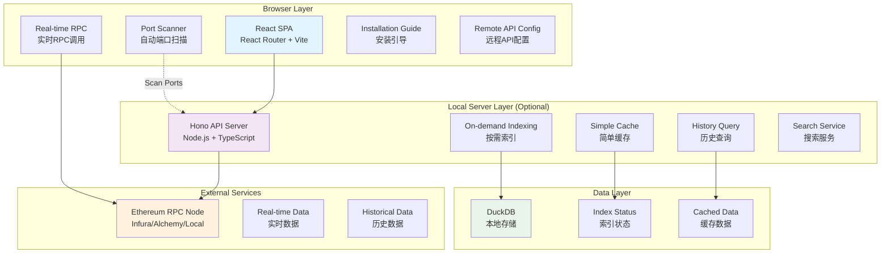
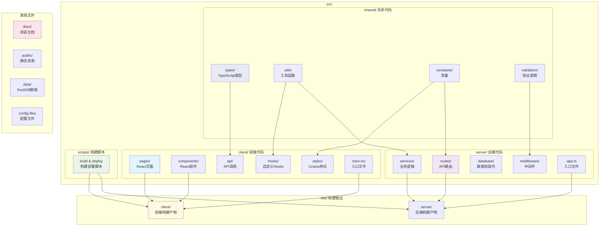

# 以太坊区块链浏览器

一个低成本、高性能的以太坊区块链浏览器，采用前后端分离架构。前端部署在静态托管平台，后端在本地提供快速数据索引服务。

## 项目特性

- 🚀 **零配置启动**：直接访问即可使用，自动扫描本地服务
- 💰 **低成本运营**：前端静态托管，后端可选本地部署
- 🔍 **智能安装**：前端自动发现本地服务，无服务时提供安装指导
- 📱 **渐进增强**：基础功能（RPC）→完整功能（本地API）
- ⚡ **混合数据源**：实时数据RPC直取，历史数据本地索引
- 🛠️ **用户友好**：支持本地安装或远程API配置

## 技术架构

### 前端技术栈
- **框架**：React 19 (最新稳定版)
- **构建工具**：Vite 6
- **路由**：React Router v7.5
- **样式**：Linaria (CSS-in-JS)
- **图表库**：ECharts 5.5
- **HTTP客户端**：fetch API
- **测试**：Vitest 2.1
- **TypeScript**：5.7
- **部署**：Cloudflare Pages

### 后端技术栈
- **运行时**：Node.js + TypeScript 5.7
- **Web框架**：Hono 5.0
- **数据库**：DuckDB 1.1
- **区块链交互**：Viem 2.21
- **日志**：Pino 9.5

### 数据策略
- **混合数据源**：实时数据RPC直取，历史数据按需获取
- **访问时同步**：无定时任务，用户访问时才获取和存储数据
- **智能缓存**：简单内存缓存，避免重复RPC调用
- **最小存储**：只存储用户实际查询过的数据

## 系统架构图



## 核心功能

### 1. 区块浏览
- 最新区块列表
- 区块详情查看
- 区块内交易列表
- 历史区块搜索

### 2. 交易查询
- 交易详情展示
- 交易状态跟踪
- Gas 费用分析
- 输入数据解析

### 3. 地址分析
- 地址余额查询
- 交易历史记录
- 代币持有情况
- 合约验证状态

### 4. 搜索功能
- 统一搜索入口
- 智能类型识别
- 模糊匹配支持
- 搜索建议

### 5. 数据统计
- 网络整体统计
- Gas 价格趋势
- 交易量分析
- 活跃地址统计

## 项目结构



## 快速开始

### 🚀 即刻体验（零安装）

直接访问在线版本：**https://your-block-explorer.pages.dev**

- ✅ 实时区块查询
- ✅ 实时余额查询  
- ✅ Gas 价格监控
- ✅ 交易状态检查
- ❌ 历史数据搜索（需要本地服务）

### 📦 完整功能（推荐）

安装本地服务以获得完整功能：

#### 一键安装
```bash
# Linux/macOS
curl -L https://install.blockexplorer.com | bash

# Windows (PowerShell)
iwr -Uri "https://install.blockexplorer.com/windows" | iex
```

#### 手动安装
```bash
# npm 安装
npm install -g @block-explorer/server

# 配置 RPC 节点
export ETHEREUM_RPC_URL=https://mainnet.infura.io/v3/YOUR_PROJECT_ID

# 启动服务
block-explorer-server start
```

#### 从源码运行
```bash
# 克隆项目
git clone https://github.com/your-repo/block-explorer.git
cd block-explorer

# 安装依赖
pnpm install --prefer-offline --registry=https://registry.npmmirror.com

# 配置环境变量
cp .env.example .env
# 编辑 .env 文件设置 ETHEREUM_RPC_URL

# 启动服务
npm run start:server
```

前端会自动检测本地服务并启用完整功能！

详细安装指南：📖 [安装文档](./docs/INSTALLATION.md)

### 部署指南

#### 前端部署 (Cloudflare Pages)

1. **构建前端**
```bash
npm run build:client
```

2. **配置 Cloudflare Pages**
- 连接 Git 仓库
- 设置构建命令：`npm run build:client`
- 设置输出目录：`dist/client`
- 配置环境变量：`VITE_API_URL`

#### 后端部署 (本地服务器)

1. **构建后端**
```bash
npm run build:server
```

2. **启动服务**
```bash
npm run start:server
```

3. **进程管理** (推荐使用 PM2)
```bash
pm2 start ecosystem.config.js
```

## API 文档

### 基础信息
- **Base URL**: `http://localhost:3001/api`
- **认证方式**: 无需认证
- **响应格式**: JSON
- **错误处理**: 标准 HTTP 状态码

### 核心接口

#### 区块相关
```typescript
GET /api/blocks/latest
GET /api/blocks/:number
GET /api/blocks?page=1&limit=20
```

#### 交易相关
```typescript
GET /api/transactions/:hash
GET /api/transactions?address=0x...&page=1&limit=20
```

#### 地址相关
```typescript
GET /api/addresses/:address
GET /api/addresses/:address/transactions?page=1&limit=20
```

#### 搜索功能
```typescript
GET /api/search/:query
```

#### 统计数据
```typescript
GET /api/stats/network
GET /api/stats/daily?days=30
```

详细的 API 文档请参考：[API.md](./docs/API.md)

## 性能优化

### 数据库优化
- **索引策略**：基于查询模式的复合索引
- **数据压缩**：DuckDB 内置压缩减少存储空间
- **查询优化**：列式存储提升分析查询性能
- **内存映射**：减少磁盘 I/O 开销

### 缓存策略
- **内存缓存**：热点数据内存缓存
- **CDN缓存**：静态资源 CDN 加速
- **浏览器缓存**：合理设置缓存头
- **API缓存**：接口级别的缓存控制

### 前端优化
- **代码分割**：按路由动态加载
- **图片优化**：Next.js Image 组件
- **预加载**：关键资源预加载
- **压缩**：Gzip/Brotli 压缩

## 监控告警

### 系统监控
- **服务状态**：健康检查接口
- **数据库性能**：查询执行时间监控
- **同步状态**：区块同步延迟监控
- **资源使用**：CPU、内存、磁盘监控

### 日志管理
- **结构化日志**：JSON 格式日志输出
- **日志级别**：支持不同级别的日志
- **日志轮转**：防止日志文件过大
- **错误追踪**：错误堆栈跟踪

## 安全考虑

### 数据安全
- **输入验证**：所有用户输入严格验证
- **SQL注入防护**：参数化查询
- **XSS防护**：输出内容转义
- **CORS配置**：合理配置跨域策略

### 访问控制
- **速率限制**：API 访问频率限制
- **IP白名单**：可选的IP访问控制
- **请求大小限制**：防止大请求攻击

## 成本分析

### 运营成本
- **前端托管**：Cloudflare Pages 免费套餐
- **域名费用**：约 $10-20/年
- **以太坊节点**：Infura 免费套餐 (10万请求/天)
- **本地服务器**：自有服务器或 VPS

### 存储成本
- **数据库文件**：5-20GB (仅按需索引，大幅减少)
- **备份存储**：轻量级备份，成本极低

### 成本优势
- **按需索引**：避免全量数据同步，节省80%+存储空间
- **混合架构**：减少API调用次数，降低RPC费用
- **简化缓存**：无需Redis等外部缓存服务

## 路线图

### v1.0 (基础版本)
- [x] 基础区块、交易、地址查询
- [x] 搜索功能
- [x] 响应式UI设计
- [x] 数据同步服务

### v1.1 (功能增强)
- [ ] 代币转账记录
- [ ] 合约交互解析
- [ ] 高级搜索过滤
- [ ] 数据导出功能

### v1.2 (性能优化)
- [ ] 查询性能优化
- [ ] 缓存策略升级
- [ ] 数据压缩优化
- [ ] 监控告警系统

### v2.0 (高级功能)
- [ ] 智能合约验证
- [ ] DeFi 协议支持
- [ ] NFT 交易追踪
- [ ] 高级数据分析

## 贡献指南

### 开发流程
1. Fork 项目仓库
2. 创建功能分支
3. 提交代码变更
4. 创建 Pull Request
5. 代码审查和合并

### 代码规范
- **TypeScript**：严格类型检查
- **ESLint**：代码质量检查
- **Prettier**：代码格式化
- **Commit规范**：Conventional Commits

### 测试要求
- **单元测试**：核心业务逻辑测试
- **集成测试**：API 接口测试
- **E2E测试**：关键用户流程测试

## 许可证

MIT License - 详见 [LICENSE](./LICENSE) 文件

## 联系方式

如有问题或建议，请通过以下方式联系：
- 创建 Issue
- 发起 Discussion
- 发送邮件至维护者

---

**注意**：本项目仅用于教育和研究目的，不构成投资建议。使用时请确保遵守相关法律法规。
