# 系统架构设计文档

## 概述

本文档详细描述了以太坊区块链浏览器的系统架构设计，包括技术选型、组件设计、数据流程等。

## 总体架构

### 架构原则

1. **前后端分离**：前端负责展示，后端负责数据处理
2. **低耦合高内聚**：模块间依赖最小化，内部功能聚合
3. **可扩展性**：支持水平扩展和功能扩展
4. **高性能**：优化查询和缓存策略
5. **低成本**：最小化运营成本

### 系统分层

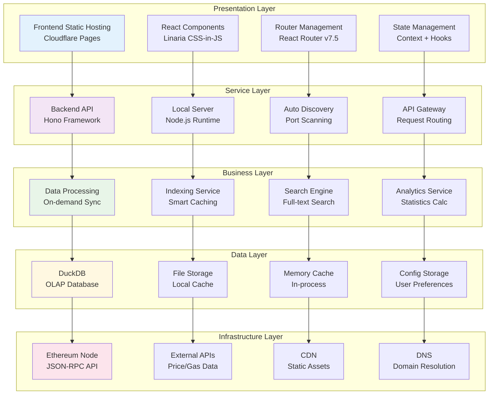

## 技术选型分析

### 前端技术选型

#### React 19 + Vite 6 选择理由
- **React 19新特性**：Actions、新Hooks（useActionState、useFormStatus、useOptimistic）
- **现代化构建**：Vite 6 提供极快的开发服务器和构建速度
- **ESM原生支持**：利用现代浏览器的原生ES模块
- **开发体验**：热模块替换(HMR)，瞬间反馈
- **插件生态**：丰富的Vite 6插件生态系统
- **Tree Shaking**：优秀的代码分割和摇树优化
- **TypeScript 5.7**：最新语言特性和类型检查

#### Linaria 选择理由
- **零运行时**：编译时CSS-in-JS，无运行时开销
- **类型安全**：TypeScript支持，编译时样式检查
- **原子化CSS**：支持原子化样式，减少包体积
- **SSR友好**：完美支持服务端渲染
- **性能优秀**：生成的CSS体积小，加载快

### 后端技术选型

#### Hono 5.0 选择理由
- **超轻量级**：体积极小，适合边缘计算
- **高性能**：基于Web标准API，性能优秀
- **TypeScript 5.7支持**：完整的类型安全支持
- **中间件生态**：丰富的中间件系统
- **跨平台**：支持Node.js、Cloudflare Workers、Deno等多种运行时
- **新特性**：更好的流式响应和WebSocket支持

#### DuckDB 1.1 选择理由
- **OLAP优化**：专为分析查询设计
- **列式存储**：高压缩率，快速聚合
- **零配置**：嵌入式数据库，无需额外配置
- **PostgreSQL兼容**：高度兼容PostgreSQL SQL方言
- **性能提升**：新版本显著提升查询性能
- **Node.js支持**：原生Node.js驱动，TypeScript友好

#### Viem 2.21 选择理由
- **类型安全**：完整的TypeScript支持
- **内置链定义**：支持所有主流EVM链
- **标准ABI库**：内置ERC20、ERC721等标准合约ABI
- **现代化API**：基于现代JavaScript特性设计

## 多链支持架构

### 统一多链架构

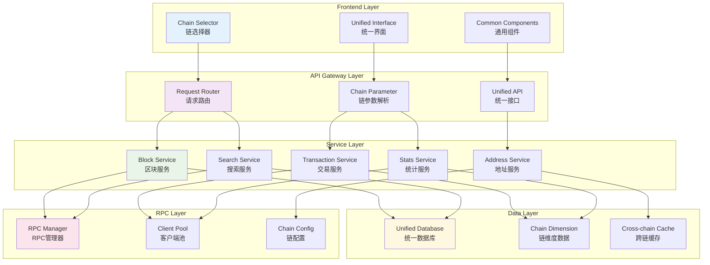

### 多链支持策略

#### 核心设计理念
- **链无关性**: 服务层不包含特定链的逻辑，链ID作为数据维度
- **统一存储**: 所有链的数据存储在同一个数据库，通过chainId字段区分
- **通用服务**: 所有服务都是链无关的，通过参数接受chainId
- **动态配置**: 支持的链通过配置文件和viem定义动态加载

#### 数据维度设计
```typescript
// 所有数据表都包含 chain_id 字段作为分区键
type BaseEntity = {
  chainId: number;    // 链ID作为数据维度
  // ... 其他业务字段
};

// 示例：区块数据结构
type Block = BaseEntity & {
  number: bigint;
  hash: string;
  timestamp: Date;
  // ... viem Block 类型的其他字段
};
```

### 统一服务设计

#### 链无关的服务层
```typescript
// src/server/services/BlockService.ts
export class BlockService {
  constructor(
    private rpcManager: RpcManager,
    private database: Database
  ) {}

  // 所有方法都接受 chainId 参数
  async getLatestBlock(chainId: number): Promise<Block> {
    const client = await this.rpcManager.getClient(chainId);
    const block = await client.getBlock({ blockTag: 'latest' });
    
    return {
      ...block,
      chainId, // 添加链维度
      network: this.rpcManager.getChainName(chainId)
    };
  }

  async getBlockByNumber(chainId: number, blockNumber: bigint): Promise<Block> {
    // 1. 检查缓存
    const cached = await this.getFromCache(chainId, blockNumber);
    if (cached) return cached;

    // 2. 查询数据库
    const stored = await this.database.get(
      'SELECT * FROM blocks WHERE chain_id = ? AND number = ?',
      [chainId, blockNumber.toString()]
    );
    if (stored) return this.mapRowToBlock(stored);

    // 3. 从RPC获取
    const client = await this.rpcManager.getClient(chainId);
    const block = await client.getBlock({ blockNumber });
    
    // 4. 异步存储
    this.storeBlock({ ...block, chainId });
    
    return { ...block, chainId };
  }

  // 链无关的存储逻辑
  private async storeBlock(block: Block): Promise<void> {
    await this.database.run(`
      INSERT OR REPLACE INTO blocks (
        chain_id, number, hash, parent_hash, timestamp, 
        miner, gas_limit, gas_used, transaction_count
      ) VALUES (?, ?, ?, ?, ?, ?, ?, ?, ?)
    `, [
      block.chainId,
      block.number.toString(),
      block.hash,
      block.parentHash,
      block.timestamp,
      block.miner,
      block.gasLimit?.toString(),
      block.gasUsed?.toString(),
      block.transactions?.length || 0
    ]);
  }
}
```

#### 数据库访问层设计

我们采用两种策略来支持 Drizzle ORM 与 DuckDB：

##### 方案一：DuckDB-PostgreSQL 适配器 (推荐)

通过编写一个 DuckDB 到 postgres.js 驱动的适配器，让 Drizzle ORM 直接支持 DuckDB：

##### 1. postgres.js 兼容适配器

```typescript
// src/server/database/duckdb-postgres-adapter.ts
import * as duckdb from 'duckdb';
import { join } from 'path';

/**
 * DuckDB 到 postgres.js 的适配器
 * 实现 postgres.js 的核心接口，让 Drizzle ORM 可以直接使用
 */
export class DuckDBPostgresAdapter {
  private db: duckdb.Database;
  private connection: duckdb.Connection;
  private isInitialized = false;

  constructor(connectionString: string) {
    // 解析连接字符串，提取数据库路径
    const dbPath = this.parseConnectionString(connectionString);
    this.db = new duckdb.Database(dbPath);
    this.connection = this.db.connect();
  }

  private parseConnectionString(connectionString: string): string {
    // 支持格式：duckdb://path/to/database.db
    if (connectionString.startsWith('duckdb://')) {
      return connectionString.replace('duckdb://', '');
    }
    // 默认路径
    return join(process.cwd(), 'data', 'blockchain.db');
  }

  // 实现 postgres.js 的核心查询接口
  async query(sql: string | TemplateStringsArray, ...params: any[]): Promise<any[]> {
    if (!this.isInitialized) {
      await this.initialize();
    }

    // 处理模板字符串格式 (Drizzle 使用的格式)
    let queryText: string;
    let queryParams: any[];

    if (typeof sql === 'string') {
      queryText = sql;
      queryParams = params;
    } else {
      // 处理模板字符串 + 参数
      queryText = sql.join('?');
      queryParams = params;
    }

    return new Promise((resolve, reject) => {
      this.connection.all(queryText, ...queryParams, (err: Error | null, result: any[]) => {
        if (err) {
          reject(this.adaptError(err));
        } else {
          resolve(this.adaptResult(result));
        }
      });
    });
  }

  // 实现 postgres.js 的事务接口
  async begin(callback: (sql: any) => Promise<any>): Promise<any> {
    await this.exec('BEGIN TRANSACTION');
    try {
      const result = await callback(this.createTransactionSql());
      await this.exec('COMMIT');
      return result;
    } catch (error) {
      await this.exec('ROLLBACK');
      throw error;
    }
  }

  // 创建事务 SQL 对象
  private createTransactionSql() {
    return {
      query: this.query.bind(this),
      // 其他 postgres.js 事务方法...
    };
  }

  // 执行 SQL 语句
  private async exec(sql: string): Promise<void> {
    return new Promise((resolve, reject) => {
      this.connection.exec(sql, (err: Error | null) => {
        if (err) reject(this.adaptError(err));
        else resolve();
      });
    });
  }

  // 错误适配 - 将 DuckDB 错误转换为 PostgreSQL 兼容格式
  private adaptError(error: Error): Error {
    // 这里可以将 DuckDB 的错误转换为 PostgreSQL 风格的错误
    // 让 Drizzle ORM 能够正确理解
    const adaptedError = new Error(error.message);
    (adaptedError as any).code = this.mapErrorCode(error.message);
    return adaptedError;
  }

  private mapErrorCode(message: string): string {
    // 将 DuckDB 错误映射到 PostgreSQL 错误代码
    if (message.includes('unique constraint')) return '23505';
    if (message.includes('not null constraint')) return '23502';
    if (message.includes('foreign key constraint')) return '23503';
    return '42000'; // 默认语法错误
  }

  // 结果适配 - 将 DuckDB 结果转换为 PostgreSQL 兼容格式
  private adaptResult(result: any[]): any[] {
    // DuckDB 和 PostgreSQL 的结果格式基本兼容
    // 这里可以做一些细微的调整
    return result.map(row => {
      // 处理 BigInt 类型转换
      const adaptedRow = { ...row };
      for (const [key, value] of Object.entries(adaptedRow)) {
        if (typeof value === 'bigint') {
          adaptedRow[key] = value.toString();
        }
      }
      return adaptedRow;
    });
  }

  // 初始化数据库
  private async initialize(): Promise<void> {
    await this.exec(`
      CREATE TABLE IF NOT EXISTS blocks (
        chain_id INTEGER NOT NULL,
        number BIGINT NOT NULL,
        hash VARCHAR(66) NOT NULL,
        parent_hash VARCHAR(66),
        timestamp TIMESTAMP,
        miner VARCHAR(42),
        gas_limit BIGINT,
        gas_used BIGINT,
        base_fee_per_gas BIGINT,
        transaction_count INTEGER,
        size_bytes INTEGER,
        indexed_at TIMESTAMP DEFAULT CURRENT_TIMESTAMP,
        PRIMARY KEY (chain_id, number),
        UNIQUE (chain_id, hash)
      );
    `);

    await this.exec(`
      CREATE TABLE IF NOT EXISTS transactions (
        chain_id INTEGER NOT NULL,
        hash VARCHAR(66) NOT NULL,
        block_number BIGINT,
        transaction_index INTEGER,
        from_address VARCHAR(42),
        to_address VARCHAR(42),
        value DECIMAL(38,0),
        gas_limit BIGINT,
        gas_price BIGINT,
        gas_used BIGINT,
        status INTEGER,
        timestamp TIMESTAMP,
        indexed_at TIMESTAMP DEFAULT CURRENT_TIMESTAMP,
        PRIMARY KEY (chain_id, hash)
      );
    `);

    this.isInitialized = true;
  }

  // 实现 postgres.js 的连接管理
  async end(): Promise<void> {
    return new Promise((resolve) => {
      this.db.close(() => resolve());
    });
  }

  // 实现 postgres.js 的监听器接口（可选）
  on(event: string, callback: Function): void {
    // DuckDB 不支持 LISTEN/NOTIFY，这里可以是空实现
  }

  off(event: string, callback?: Function): void {
    // 空实现
  }
}

// 创建适配器工厂函数，模拟 postgres.js 的使用方式
export function createDuckDBAdapter(connectionString: string) {
  const adapter = new DuckDBPostgresAdapter(connectionString);
  
  // 返回一个类似 postgres.js 的函数接口
  const sql = async (query: string | TemplateStringsArray, ...params: any[]) => {
    return adapter.query(query, ...params);
  };

  // 添加 postgres.js 的其他方法
  sql.begin = adapter.begin.bind(adapter);
  sql.end = adapter.end.bind(adapter);
  sql.on = adapter.on.bind(adapter);
  sql.off = adapter.off.bind(adapter);

  return sql;
}
```

##### 2. Drizzle ORM 配置

```typescript
// src/server/database/drizzle.ts
import { drizzle } from 'drizzle-orm/postgres-js';
import { createDuckDBAdapter } from './duckdb-postgres-adapter.js';
import * as schema from './schema.js';

// 创建 DuckDB 适配器
const duckdbAdapter = createDuckDBAdapter('duckdb://data/blockchain.db');

// 配置 Drizzle ORM
export const db = drizzle(duckdbAdapter as any, { schema });

// 现在可以使用标准的 Drizzle ORM 语法！
export const blockRepository = {
  findLatest: (chainId: number, limit = 20) =>
    db.select()
      .from(schema.blocks)
      .where(eq(schema.blocks.chainId, chainId))
      .orderBy(desc(schema.blocks.number))
      .limit(limit),

  findByNumber: (chainId: number, blockNumber: bigint) =>
    db.select()
      .from(schema.blocks)
      .where(and(
        eq(schema.blocks.chainId, chainId),
        eq(schema.blocks.number, blockNumber)
      ))
      .get(),

  create: (block: typeof schema.blocks.$inferInsert) =>
    db.insert(schema.blocks).values(block),
};
```

##### 3. Drizzle Schema 定义

```typescript
// src/server/database/schema.ts
import {
  integer,
  varchar,
  bigint,
  timestamp,
  pgTable,
  primaryKey,
  unique,
  decimal,
} from 'drizzle-orm/pg-core';

export const blocks = pgTable('blocks', {
  chainId: integer('chain_id').notNull(),
  number: bigint('number', { mode: 'bigint' }).notNull(),
  hash: varchar('hash', { length: 66 }).notNull(),
  parentHash: varchar('parent_hash', { length: 66 }),
  timestamp: timestamp('timestamp'),
  miner: varchar('miner', { length: 42 }),
  gasLimit: bigint('gas_limit', { mode: 'bigint' }),
  gasUsed: bigint('gas_used', { mode: 'bigint' }),
  baseFeePerGas: bigint('base_fee_per_gas', { mode: 'bigint' }),
  transactionCount: integer('transaction_count'),
  sizeBytes: integer('size_bytes'),
  indexedAt: timestamp('indexed_at').defaultNow(),
}, (table) => ({
  pk: primaryKey({ columns: [table.chainId, table.number] }),
  hashUnique: unique().on(table.chainId, table.hash),
}));

export const transactions = pgTable('transactions', {
  chainId: integer('chain_id').notNull(),
  hash: varchar('hash', { length: 66 }).notNull(),
  blockNumber: bigint('block_number', { mode: 'bigint' }),
  transactionIndex: integer('transaction_index'),
  fromAddress: varchar('from_address', { length: 42 }),
  toAddress: varchar('to_address', { length: 42 }),
  value: decimal('value', { precision: 38, scale: 0 }),
  gasLimit: bigint('gas_limit', { mode: 'bigint' }),
  gasPrice: bigint('gas_price', { mode: 'bigint' }),
  gasUsed: bigint('gas_used', { mode: 'bigint' }),
  status: integer('status'),
  timestamp: timestamp('timestamp'),
  indexedAt: timestamp('indexed_at').defaultNow(),
}, (table) => ({
  pk: primaryKey({ columns: [table.chainId, table.hash] }),
}));

// 类型推断
export type Block = typeof blocks.$inferSelect;
export type NewBlock = typeof blocks.$inferInsert;
export type Transaction = typeof transactions.$inferSelect;
export type NewTransaction = typeof transactions.$inferInsert;
```

##### 2. 类型安全的查询构建器

```typescript
// src/server/database/queryBuilder.ts
export class QueryBuilder {
  private db: DatabaseConnection;
  
  constructor(db: DatabaseConnection) {
    this.db = db;
  }
  
  // 类型安全的查询方法
  async findBlockByNumber(chainId: number, blockNumber: bigint): Promise<Block | null> {
    const row = await this.db.get(`
      SELECT * FROM blocks 
      WHERE chain_id = ? AND number = ?
    `, [chainId, blockNumber.toString()]);
    
    return row ? this.mapRowToBlock(row) : null;
  }
  
  async findTransactionsByAddress(
    chainId: number, 
    address: string, 
    limit: number = 20,
    offset: number = 0
  ): Promise<Transaction[]> {
    const rows = await this.db.all(`
      SELECT t.*, b.timestamp 
      FROM transactions t
      JOIN blocks b ON t.chain_id = b.chain_id AND t.block_number = b.number
      WHERE t.chain_id = ? AND (t.from_address = ? OR t.to_address = ?)
      ORDER BY b.timestamp DESC
      LIMIT ? OFFSET ?
    `, [chainId, address.toLowerCase(), address.toLowerCase(), limit, offset]);
    
    return rows.map(row => this.mapRowToTransaction(row));
  }
  
  // 类型转换辅助方法
  private mapRowToBlock(row: any): Block {
    return {
      chainId: row.chain_id,
      number: BigInt(row.number),
      hash: row.hash as `0x${string}`,
      parentHash: row.parent_hash as `0x${string}`,
      timestamp: BigInt(Math.floor(new Date(row.timestamp).getTime() / 1000)),
      miner: row.miner as `0x${string}`,
      gasLimit: row.gas_limit ? BigInt(row.gas_limit) : undefined,
      gasUsed: row.gas_used ? BigInt(row.gas_used) : undefined,
      baseFeePerGas: row.base_fee_per_gas ? BigInt(row.base_fee_per_gas) : undefined,
      // ... 其他字段映射
    } as Block;
  }
  
  private mapRowToTransaction(row: any): Transaction {
    return {
      chainId: row.chain_id,
      hash: row.hash as `0x${string}`,
      blockNumber: BigInt(row.block_number),
      transactionIndex: row.transaction_index,
      from: row.from_address as `0x${string}`,
      to: row.to_address as `0x${string}`,
      value: BigInt(row.value),
      gas: BigInt(row.gas_limit),
      gasPrice: row.gas_price ? BigInt(row.gas_price) : undefined,
      // ... 其他字段映射
    } as Transaction;
  }
}
```

##### 3. Repository 模式

```typescript
// src/server/repositories/BlockRepository.ts
export class BlockRepository {
  private queryBuilder: QueryBuilder;
  
  constructor(queryBuilder: QueryBuilder) {
    this.queryBuilder = queryBuilder;
  }
  
  async findLatest(chainId: number, limit: number = 20): Promise<Block[]> {
    return await this.queryBuilder.findLatestBlocks(chainId, limit);
  }
  
  async findByNumber(chainId: number, blockNumber: bigint): Promise<Block | null> {
    return await this.queryBuilder.findBlockByNumber(chainId, blockNumber);
  }
  
  async save(block: Block): Promise<void> {
    await this.queryBuilder.insertBlock(block);
  }
  
  async findByRange(
    chainId: number, 
    fromBlock: bigint, 
    toBlock: bigint
  ): Promise<Block[]> {
    return await this.queryBuilder.findBlocksByRange(chainId, fromBlock, toBlock);
  }
}
```

##### 4. 迁移管理

```typescript
// src/server/database/migrations.ts
export class MigrationManager {
  private db: DatabaseConnection;
  
  constructor(db: DatabaseConnection) {
    this.db = db;
  }
  
  async runMigrations(): Promise<void> {
    await this.createMigrationsTable();
    
    const migrations = [
      { version: 1, name: 'initial_schema', sql: INITIAL_SCHEMA },
      { version: 2, name: 'add_indexes', sql: ADD_INDEXES },
      { version: 3, name: 'add_user_rpc_configs', sql: ADD_USER_RPC_CONFIGS },
    ];
    
    for (const migration of migrations) {
      const applied = await this.isMigrationApplied(migration.version);
      if (!applied) {
        await this.applyMigration(migration);
      }
    }
  }
  
  private async applyMigration(migration: Migration): Promise<void> {
    await this.db.exec(migration.sql);
    await this.db.run(
      'INSERT INTO migrations (version, name, applied_at) VALUES (?, ?, ?)',
      [migration.version, migration.name, new Date().toISOString()]
    );
    console.log(`✅ Applied migration: ${migration.name}`);
  }
}
```

##### 5. 事务支持

```typescript
// src/server/database/transaction.ts
export class DatabaseTransaction {
  private db: DatabaseConnection;
  
  constructor(db: DatabaseConnection) {
    this.db = db;
  }
  
  async withTransaction<T>(callback: (tx: DatabaseTransaction) => Promise<T>): Promise<T> {
    await this.db.exec('BEGIN TRANSACTION');
    try {
      const result = await callback(this);
      await this.db.exec('COMMIT');
      return result;
    } catch (error) {
      await this.db.exec('ROLLBACK');
      throw error;
    }
  }
  
  async insertBlockWithTransactions(
    block: Block, 
    transactions: Transaction[]
  ): Promise<void> {
    await this.withTransaction(async () => {
      await this.insertBlock(block);
      for (const tx of transactions) {
        await this.insertTransaction(tx);
      }
    });
  }
}
```

##### 方案二：原生封装 (备选)

如果适配器遇到兼容性问题，我们保留原生封装方案作为备选：

```typescript
// 原生封装方案的实现保持不变
export class QueryBuilder {
  private db: DatabaseConnection;
  // ... 之前的实现
}
```

#### 技术方案对比

| 特性 | DuckDB-PostgreSQL 适配器 | 原生封装 |
|------|-------------------------|----------|
| **ORM 支持** | ✅ 完整 Drizzle ORM | ❌ 手写查询 |
| **类型安全** | ✅ Drizzle 类型推断 | ✅ 手动类型转换 |
| **开发效率** | ✅ 高 (ORM 语法) | ⚠️ 中 (SQL 编写) |
| **性能** | ⚠️ 适配器开销 | ✅ 原生性能 |
| **迁移支持** | ✅ Drizzle Kit | ❌ 手动管理 |
| **关系查询** | ✅ ORM 关联查询 | ❌ 手动 JOIN |
| **维护成本** | ⚠️ 适配器维护 | ✅ 简单直接 |

#### 推荐方案

**优先使用适配器方案**，原因：
- **开发效率**: Drizzle ORM 的类型安全和 API 设计
- **团队协作**: 标准化的 ORM 语法，降低学习成本
- **功能完整**: 支持迁移、关系查询、事务等
- **未来扩展**: 当官方支持 DuckDB 时，可以无缝迁移

这种设计提供了：
- **最佳开发体验**：享受 Drizzle ORM 的所有优势
- **PostgreSQL 兼容**：充分利用 DuckDB 的兼容性
- **类型安全**：完整的 TypeScript 支持
- **灵活性**：可以在两种方案之间切换
- **扩展性**：未来可以轻松升级到官方 ORM 支持

## 组件设计

### Monorepo 组件架构

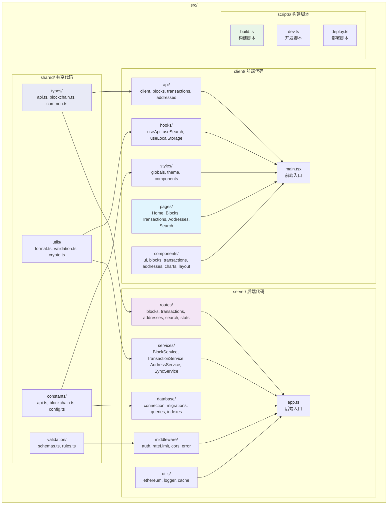

### 共享代码优势

采用 Monorepo 结构的主要优势：

1. **类型共享**：前后端使用相同的类型定义，确保数据一致性
2. **工具复用**：格式化、验证等工具函数可以在前后端复用
3. **常量统一**：API路径、配置项等常量集中管理
4. **代码同步**：前后端代码变更可以同步进行，减少版本不一致问题
5. **构建优化**：可以实现增量构建和智能缓存

### 类型共享示例

```typescript
// src/shared/types/api.ts
// 成功响应：直接返回数据
export type DataResponse<T> = T;

// 列表响应：包含数据和分页信息
export type ListResponse<T> = {
  data: T[];
  pagination: PaginationInfo;
};

// 错误响应：简化结构
export type ErrorResponse = {
  code: string;
  message: string;
  details?: any;
};

export type PaginationInfo = {
  page: number;
  limit: number;
  total: number;
  totalPages: number;
  hasNext: boolean;
  hasPrev: boolean;
};

// src/shared/types/blockchain.ts  
// 使用viem内置类型并扩展多链支持
import type { 
  Block as ViemBlock, 
  Transaction as ViemTransaction,
  Address, 
  Hash 
} from 'viem';

export type Block = ViemBlock & {
  chainId: number;       // 新增：链ID
  network: string;       // 新增：网络名称
  transactionCount: number; // 交易数量统计
};

export type Transaction = ViemTransaction & {
  chainId: number;       // 新增：链ID
  gasUsed?: string;      // 实际使用Gas（从receipt获取）
  status?: number;       // 交易状态（从receipt获取）
  timestamp: string;     // 新增：时间戳
  network: string;       // 新增：网络名称
};

export type AddressInfo = {
  chainId: number;       // 新增：链ID
  address: Address;      // 使用viem的Address类型
  balance: string;
  transactionCount: number;
  isContract: boolean;
  network: string;       // 新增：网络名称
  label?: string;        // 用户自定义标签
};

// 前端使用 - 多链支持
// src/client/api/blocks.ts
import type { DataResponse, Block } from '../../shared/types/index.js';

export async function getLatestBlock(chainId: number = 1): Promise<DataResponse<Block>> {
  // 多链API调用，通过chainId参数指定链
  const response = await fetch(`/api/chains/${chainId}/blocks/latest`);
  if (!response.ok) {
    const error: ErrorResponse = await response.json();
    throw new Error(error.message);
  }
  return response.json(); // 直接返回Block数据，包含chainId
}

export async function getBlockByNumber(
  chainId: number, 
  blockNumber: number
): Promise<DataResponse<Block>> {
  const response = await fetch(`/api/chains/${chainId}/blocks/${blockNumber}`);
  if (!response.ok) {
    const error: ErrorResponse = await response.json();
    throw new Error(error.message);
  }
  return response.json();
}

// 后端使用 - 统一服务路由  
// src/server/routes/blocks.ts
import { Context } from 'hono';
import type { DataResponse, Block } from '../../shared/types/index.js';
import { BlockService } from '../services/BlockService.js';

export async function handleGetLatestBlock(c: Context): Promise<Response> {
  const chainId = parseInt(c.req.param('chainId'));
  const blockService = new BlockService();
  
  // 服务层统一处理，chainId作为参数传入
  const block = await blockService.getLatestBlock(chainId);
  
  // 设置响应头（元数据）
  c.header('X-Response-Time', '25ms');
  c.header('X-Data-Source', 'database');
  c.header('X-Chain-ID', chainId.toString());
  c.header('X-Network', block.network);
  
  // 直接返回数据，无包装
  return c.json(block);
}
```

## 数据流设计

### 简化的数据策略

基于用户访问驱动的混合数据源架构，彻底简化数据同步策略：

#### 混合数据源架构

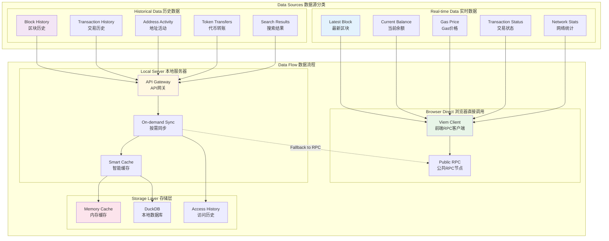

### 用户访问驱动的数据同步流程

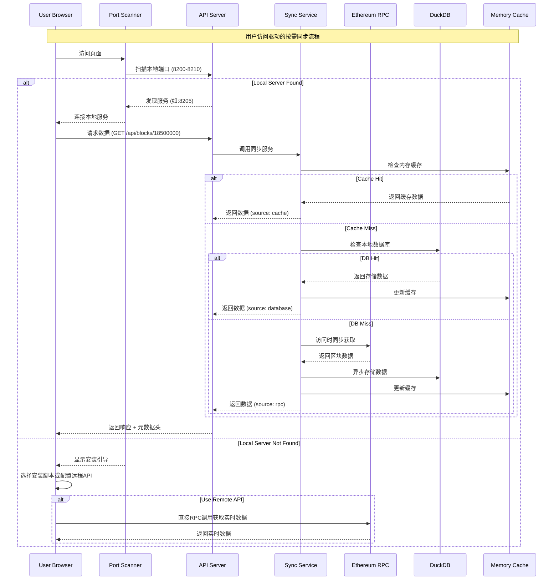

### 地址交易查询策略

基于标准RPC的轻量级地址交易查询方案，无需依赖外部API或全量索引。

#### 核心思路

利用 `getTransactionCount` 和余额变化的二分查找算法，在有限的RPC调用次数内定位地址相关的交易。

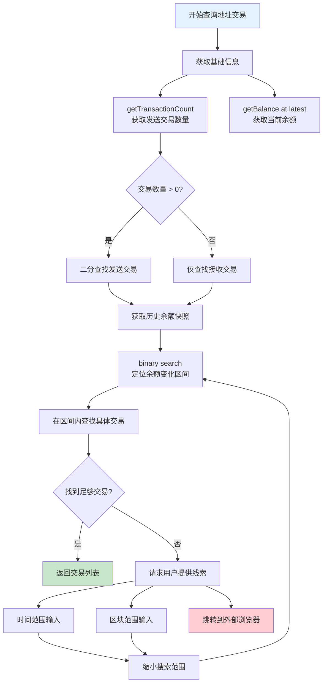

#### 算法实现

##### 1. 基础信息收集
```typescript
// 获取地址基础信息
async function getAddressBasicInfo(address: string): Promise<{
  transactionCount: number;
  currentBalance: bigint;
  latestBlock: number;
}> {
  const [txCount, balance, latestBlock] = await Promise.all([
    rpcClient.getTransactionCount(address),
    rpcClient.getBalance(address),
    rpcClient.getBlockNumber()
  ]);
  
  return { transactionCount: txCount, currentBalance: balance, latestBlock };
}
```

##### 2. 二分查找余额变化
```typescript
// 二分查找余额变化的区块范围
async function findBalanceChangeBlocks(
  address: string, 
  startBlock: number, 
  endBlock: number,
  maxAttempts: number = 20
): Promise<{ blockNumber: number; balance: bigint }[]> {
  const changes: { blockNumber: number; balance: bigint }[] = [];
  const visited = new Set<number>();
  
  async function binarySearch(start: number, end: number, depth: number = 0) {
    if (depth >= maxAttempts || end - start <= 1) return;
    
    const mid = Math.floor((start + end) / 2);
    if (visited.has(mid)) return;
    visited.add(mid);
    
    const [startBalance, midBalance, endBalance] = await Promise.all([
      rpcClient.getBalance(address, start),
      rpcClient.getBalance(address, mid),
      rpcClient.getBalance(address, end)
    ]);
    
    // 检查余额变化
    if (startBalance !== midBalance) {
      changes.push({ blockNumber: mid, balance: midBalance });
      await binarySearch(start, mid, depth + 1);
    }
    
    if (midBalance !== endBalance) {
      changes.push({ blockNumber: mid, balance: midBalance });
      await binarySearch(mid, end, depth + 1);
    }
  }
  
  await binarySearch(startBlock, endBlock);
  return changes.sort((a, b) => b.blockNumber - a.blockNumber);
}
```

##### 3. 交易定位与提取
```typescript
// 在指定区块范围内查找地址相关交易
async function findTransactionsInRange(
  address: string,
  startBlock: number,
  endBlock: number
): Promise<Transaction[]> {
  const transactions: Transaction[] = [];
  const maxBlocks = Math.min(endBlock - startBlock, 100); // 限制查找范围
  
  for (let i = 0; i < maxBlocks; i++) {
    const blockNumber = endBlock - i;
    if (blockNumber < startBlock) break;
    
    try {
      const block = await rpcClient.getBlock(blockNumber, true);
      if (!block?.transactions) continue;
      
      // 筛选与目标地址相关的交易
      const relatedTxs = block.transactions.filter(tx => 
        tx.from?.toLowerCase() === address.toLowerCase() ||
        tx.to?.toLowerCase() === address.toLowerCase()
      );
      
      transactions.push(...relatedTxs);
    } catch (error) {
      console.warn(`Failed to fetch block ${blockNumber}:`, error);
    }
  }
  
  return transactions;
}
```

#### 用户交互策略

##### 1. 渐进式搜索体验
```typescript
// 分阶段搜索策略
const searchPhases = [
  {
    name: "快速搜索",
    maxAttempts: 10,
    blockRange: 1000,
    description: "搜索最近1000个区块"
  },
  {
    name: "扩展搜索", 
    maxAttempts: 20,
    blockRange: 10000,
    description: "扩展到最近10000个区块"
  },
  {
    name: "用户辅助搜索",
    requiresInput: true,
    description: "请提供时间范围或区块范围"
  }
];
```

##### 2. 用户输入辅助
```typescript
type SearchHint = {
  timeRange?: { start: Date; end: Date };
  blockRange?: { start: number; end: number };
  transactionHash?: string;
  knownActivity?: 'defi' | 'nft' | 'transfer';
};

// 根据用户提示优化搜索
async function searchWithHints(
  address: string, 
  hints: SearchHint
): Promise<Transaction[]> {
  if (hints.transactionHash) {
    // 直接查询已知交易
    return await getTransactionDetails(hints.transactionHash);
  }
  
  if (hints.timeRange) {
    // 时间范围转换为区块范围
    const blockRange = await timeToBlockRange(hints.timeRange);
    return await findTransactionsInRange(address, blockRange.start, blockRange.end);
  }
  
  if (hints.blockRange) {
    // 直接使用区块范围
    return await findTransactionsInRange(address, hints.blockRange.start, hints.blockRange.end);
  }
  
  // 默认搜索策略
  return await performDefaultSearch(address);
}
```

#### 局限性与应对策略

##### 1. 技术局限性
- **合约地址**: 无法通过 `getTransactionCount` 检测接收交易
- **复杂交易**: DeFi、NFT等内部转账难以检测
- **性能限制**: 大量RPC调用可能导致延迟

##### 2. 用户体验优化
```typescript
// 结果展示策略
type SearchResult = {
  transactions: Transaction[];
  searchMethod: 'binary_search' | 'user_hint' | 'partial';
  completeness: 'complete' | 'partial' | 'unknown';
  suggestions: string[];
  externalLinks: {
    etherscan: string;
    blockscout?: string;
    [key: string]: string;
  };
};

// 提供外部浏览器链接
function generateExternalLinks(address: string, chainId: number): ExternalLinks {
  const links: ExternalLinks = {};
  
  switch (chainId) {
    case 1: // Ethereum Mainnet
      links.etherscan = `https://etherscan.io/address/${address}`;
      break;
    case 137: // Polygon
      links.polygonscan = `https://polygonscan.com/address/${address}`;
      break;
    case 56: // BSC
      links.bscscan = `https://bscscan.com/address/${address}`;
      break;
    // ... 其他链
  }
  
  return links;
}
```

##### 3. 错误处理与降级
```typescript
// 智能降级策略
async function searchAddressTransactions(
  address: string,
  options: SearchOptions = {}
): Promise<SearchResult> {
  try {
    // 尝试二分查找
    const result = await binarySearchTransactions(address, options);
    if (result.transactions.length > 0) {
      return {
        ...result,
        searchMethod: 'binary_search',
        completeness: 'partial'
      };
    }
  } catch (error) {
    console.warn('Binary search failed:', error);
  }
  
  // 降级到用户辅助
  return {
    transactions: [],
    searchMethod: 'user_hint',
    completeness: 'unknown',
    suggestions: [
      '请提供大概的交易时间',
      '如果知道具体交易哈希，请直接搜索',
      '点击下方链接查看完整交易历史'
    ],
    externalLinks: generateExternalLinks(address, options.chainId || 1)
  };
}
```

#### 性能优化

##### 1. 请求批量化
```typescript
// 批量RPC请求优化
async function batchGetBalances(
  address: string, 
  blockNumbers: number[]
): Promise<Map<number, bigint>> {
  const batchSize = 10; // 每批请求数量
  const results = new Map<number, bigint>();
  
  for (let i = 0; i < blockNumbers.length; i += batchSize) {
    const batch = blockNumbers.slice(i, i + batchSize);
    const balances = await Promise.all(
      batch.map(block => rpcClient.getBalance(address, block))
    );
    
    batch.forEach((block, index) => {
      results.set(block, balances[index]);
    });
  }
  
  return results;
}
```

##### 2. 智能缓存
```typescript
// 地址查询结果缓存
const addressSearchCache = new Map<string, {
  result: SearchResult;
  timestamp: number;
  blockHeight: number;
}>();

// 缓存策略：按地址+区块高度缓存
function getCacheKey(address: string, blockHeight: number): string {
  return `${address}:${Math.floor(blockHeight / 1000) * 1000}`; // 1000区块粒度
}
```

这种轻量级的地址交易查询策略在保持系统简单性的同时，为用户提供了实用的交易查找功能，并通过渐进式搜索和外部链接确保良好的用户体验。

### 合约事件索引策略

针对合约地址，采用基于事件日志的索引策略，提供高级事件过滤和分析能力。

#### 核心思路

合约地址的交易查询以事件索引为主导，通过 `eth_getLogs` API 高效查询事件日志，再关联对应的交易详情。

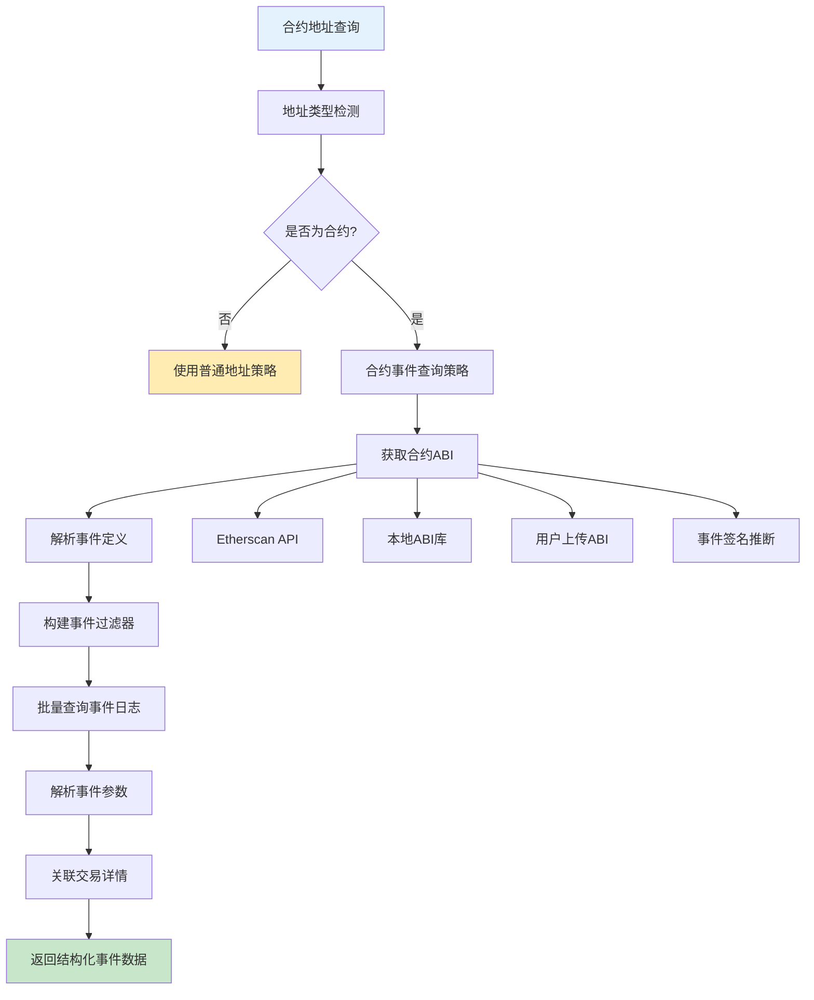

#### ABI获取与管理

采用简化的三源策略：Sourcify + 标准合约库 + 用户上传，避免复杂的推断算法。

##### 1. 简化的ABI获取策略

```typescript
// 简化的ABI管理器
class SimpleAbiManager {
  async getContractAbi(address: string, chainId: number): Promise<{
    abi: any[];
    source: 'sourcify' | 'standard' | 'user';
    verified: boolean;
  }> {
    // 1. 优先检查用户已上传/选择的ABI
    const userAbi = await this.getUserAbi(address, chainId);
    if (userAbi) {
      return { abi: userAbi, source: 'user', verified: true };
    }

    // 2. 尝试Sourcify（免费的去中心化验证服务）
    try {
      const sourcifyAbi = await this.getFromSourcery(address, chainId);
      return { abi: sourcifyAbi, source: 'sourcify', verified: true };
    } catch (error) {
      console.log('Sourcify未找到合约ABI:', error.message);
    }

    // 3. 检查是否匹配标准合约
    const standardAbi = await this.matchStandardContract(address, chainId);
    if (standardAbi) {
      return { abi: standardAbi, source: 'standard', verified: false };
    }

    // 4. 都找不到，返回错误提示用户上传
    throw new Error('ABI_NOT_FOUND');
  }
}
```

##### 2. Sourcify集成（主要数据源）

```typescript
class SourceryProvider {
  private readonly BASE_URL = 'https://sourcify.dev/server';

  async getVerifiedAbi(address: string, chainId: number): Promise<any[]> {
    try {
      // 检查合约是否已验证
      const checkResponse = await fetch(`${this.BASE_URL}/check-by-addresses`, {
        method: 'POST',
        headers: { 'Content-Type': 'application/json' },
        body: JSON.stringify({
          addresses: [address],
          chainIds: [chainId.toString()]
        })
      });
      
      const checkResult = await checkResponse.json();
      if (!checkResult[0] || checkResult[0].status !== 'perfect') {
        throw new Error('Contract not verified in Sourcify');
      }

      // 获取合约元数据
      const filesResponse = await fetch(
        `${this.BASE_URL}/files/any/${chainId}/${address}`
      );
      const files = await filesResponse.json();
      
      const metadataFile = files.find(f => f.name.endsWith('metadata.json'));
      if (!metadataFile) {
        throw new Error('Metadata not found');
      }

      const metadataResponse = await fetch(metadataFile.url);
      const metadata = await metadataResponse.json();
      
      return metadata.output.abi;
    } catch (error) {
      throw new Error(`Sourcify ABI获取失败: ${error.message}`);
    }
  }
}
```

##### 3. 基于viem的标准合约库

```typescript
// 使用viem内置的ABI定义
import { 
  erc20Abi, 
  erc721Abi, 
  erc1155Abi 
} from 'viem';

// 扩展viem的标准ABI库
const VIEM_STANDARD_CONTRACTS = {
  'ERC20': {
    abi: erc20Abi,
    selectors: [
      '0x70a08231', // balanceOf
      '0xa9059cbb', // transfer  
      '0x23b872dd', // transferFrom
      '0x095ea7b3'  // approve
    ]
  },
  
  'ERC721': {
    abi: erc721Abi,
    selectors: [
      '0x70a08231', // balanceOf
      '0x6352211e', // ownerOf
      '0x23b872dd', // transferFrom
      '0xa22cb465'  // setApprovalForAll
    ]
  },
  
  'ERC1155': {
    abi: erc1155Abi,
    selectors: [
      '0x00fdd58e', // balanceOf
      '0x4e1273f4', // balanceOfBatch
      '0xf242432a', // safeTransferFrom
      '0x2eb2c2d6'  // safeBatchTransferFrom
    ]
  }
};

// DeFi协议ABI（手动定义的常用协议）
const DEFI_CONTRACTS = {
  'UniswapV2Pair': {
    abi: [
      {
        "name": "Swap",
        "type": "event",
        "inputs": [
          {"name": "sender", "type": "address", "indexed": true},
          {"name": "amount0In", "type": "uint256", "indexed": false},
          {"name": "amount1In", "type": "uint256", "indexed": false},
          {"name": "amount0Out", "type": "uint256", "indexed": false},
          {"name": "amount1Out", "type": "uint256", "indexed": false},
          {"name": "to", "type": "address", "indexed": true}
        ]
      },
      {
        "name": "getReserves",
        "type": "function",
        "inputs": [],
        "outputs": [
          {"name": "reserve0", "type": "uint112"},
          {"name": "reserve1", "type": "uint112"},
          {"name": "blockTimestampLast", "type": "uint32"}
        ],
        "stateMutability": "view"
      }
    ],
    selectors: ['0x0902f1ac', '0x4f1eb3d8', '0xba9a7a56']
  }
};

// 合并所有标准合约
const ALL_STANDARD_CONTRACTS = {
  ...VIEM_STANDARD_CONTRACTS,
  ...DEFI_CONTRACTS
};

// 智能合约检测服务
class ContractStandardDetector {
  async detectStandard(address: string, chainId: number): Promise<string[]> {
    const detectedStandards = [];
    
    for (const [standard, config] of Object.entries(ALL_STANDARD_CONTRACTS)) {
      try {
        const isMatch = await this.checkContractInterface(address, config.selectors, chainId);
        if (isMatch) {
          detectedStandards.push(standard);
        }
      } catch (error) {
        console.warn(`Failed to check ${standard} for ${address}:`, error);
      }
    }
    
    return detectedStandards;
  }

  private async checkContractInterface(
    address: string, 
    selectors: string[], 
    chainId: number
  ): Promise<boolean> {
    const rpcClient = await this.rpcManager.getClient(chainId);
    
    // 检查合约是否支持这些函数选择器
    let matchCount = 0;
    
    for (const selector of selectors) {
      try {
        // 尝试调用静态函数检查是否存在
        const result = await rpcClient.call({
          to: address as `0x${string}`,
          data: selector as `0x${string}`
        });
        
        // 如果没有抛出错误，说明函数存在
        if (result) {
          matchCount++;
        }
      } catch (error) {
        // 函数不存在或调用失败
      }
    }
    
    // 如果匹配数量超过阈值，认为是该标准的合约
    return matchCount >= Math.ceil(selectors.length * 0.6);
  }

  getStandardAbi(standard: string): any[] {
    return ALL_STANDARD_CONTRACTS[standard]?.abi || [];
  }
}
```

##### 4. 用户ABI管理

```typescript
// 用户ABI存储管理
class UserAbiStorage {
  private readonly STORAGE_KEY = 'user_contract_abis';

  // 保存用户上传的ABI
  saveUserAbi(address: string, chainId: number, abi: any[], name?: string): void {
    const key = `${chainId}:${address.toLowerCase()}`;
    const userAbis = this.getUserAbis();
    
    userAbis[key] = {
      abi,
      name: name || `Contract ${address.slice(0, 8)}...`,
      uploadedAt: Date.now(),
      address: address.toLowerCase(),
      chainId
    };
    
    localStorage.setItem(this.STORAGE_KEY, JSON.stringify(userAbis));
  }

  // 获取用户ABI
  getUserAbi(address: string, chainId: number): any[] | null {
    const key = `${chainId}:${address.toLowerCase()}`;
    const userAbis = this.getUserAbis();
    return userAbis[key]?.abi || null;
  }

  // 获取所有用户ABI
  getUserAbis(): Record<string, UserAbiRecord> {
    try {
      const stored = localStorage.getItem(this.STORAGE_KEY);
      return stored ? JSON.parse(stored) : {};
    } catch (error) {
      return {};
    }
  }

  // 删除用户ABI
  removeUserAbi(address: string, chainId: number): void {
    const key = `${chainId}:${address.toLowerCase()}`;
    const userAbis = this.getUserAbis();
    delete userAbis[key];
    localStorage.setItem(this.STORAGE_KEY, JSON.stringify(userAbis));
  }
}

type UserAbiRecord = {
  abi: any[];
  name: string;
  uploadedAt: number;
  address: string;
  chainId: number;
};
```

#### 事件查询与过滤系统

##### 1. 高级事件过滤器

```typescript
// 事件过滤器配置
type EventFilter = {
  contractAddress: string;
  chainId: number;
  eventNames?: string[];           // 事件名称过滤
  topics?: (string | string[])[];  // 主题过滤
  fromBlock?: number | 'latest';   // 起始区块
  toBlock?: number | 'latest';     // 结束区块
  paramFilters?: {                 // 参数过滤
    [paramName: string]: {
      operator: 'eq' | 'gt' | 'lt' | 'in' | 'contains';
      value: any;
    };
  };
  timeRange?: {                    // 时间范围过滤
    start: Date;
    end: Date;
  };
  limit?: number;                  // 结果限制
  offset?: number;                 // 偏移量
};

// 事件查询服务
class EventQueryService {
  async queryContractEvents(filter: EventFilter): Promise<{
    events: ParsedEvent[];
    total: number;
    hasMore: boolean;
  }> {
    // 1. 获取合约ABI
    const abiInfo = await this.abiManager.getContractAbi({
      contractAddress: filter.contractAddress,
      chainId: filter.chainId,
      preferredSources: ['local', 'etherscan', 'inferred'],
      fallbackEnabled: true,
      cacheExpiry: 24 // 24小时缓存
    });

    // 2. 构建事件签名映射
    const eventSignatures = this.buildEventSignatures(abiInfo.abi);

    // 3. 转换为eth_getLogs参数
    const logFilter = await this.buildLogFilter(filter, eventSignatures);

    // 4. 批量查询事件日志
    const logs = await this.fetchEventLogs(logFilter);

    // 5. 解析事件参数
    const parsedEvents = await this.parseEventLogs(logs, abiInfo.abi);

    // 6. 应用高级过滤
    const filteredEvents = this.applyAdvancedFilters(parsedEvents, filter);

    // 7. 分页处理
    const paginatedResult = this.paginateResults(filteredEvents, filter);

    return paginatedResult;
  }

  private buildEventSignatures(abi: any[]): Map<string, any> {
    const signatures = new Map();
    
    abi.filter(item => item.type === 'event').forEach(event => {
      const signature = this.getEventSignature(event);
      signatures.set(signature, event);
    });

    return signatures;
  }

  private getEventSignature(event: any): string {
    const inputs = event.inputs.map((input: any) => input.type).join(',');
    return keccak256(`${event.name}(${inputs})`);
  }

  private async buildLogFilter(
    filter: EventFilter, 
    eventSignatures: Map<string, any>
  ): Promise<any> {
    const logFilter: any = {
      address: filter.contractAddress,
      fromBlock: filter.fromBlock || 'earliest',
      toBlock: filter.toBlock || 'latest'
    };

    // 构建topics过滤器
    if (filter.eventNames && filter.eventNames.length > 0) {
      const eventTopics = filter.eventNames.map(name => {
        const matchingSignature = Array.from(eventSignatures.entries())
          .find(([_, event]) => event.name === name)?.[0];
        return matchingSignature;
      }).filter(Boolean);

      if (eventTopics.length > 0) {
        logFilter.topics = [eventTopics];
      }
    }

    // 时间范围转换为区块范围
    if (filter.timeRange) {
      const blockRange = await this.timeToBlockRange(filter.timeRange, filter.chainId);
      logFilter.fromBlock = Math.max(logFilter.fromBlock || 0, blockRange.start);
      logFilter.toBlock = Math.min(logFilter.toBlock || blockRange.end, blockRange.end);
    }

    return logFilter;
  }
}
```

##### 2. 事件解析与数据结构

```typescript
// 解析后的事件数据结构
type ParsedEvent = {
  eventName: string;
  eventSignature: string;
  contractAddress: string;
  blockNumber: number;
  blockHash: string;
  transactionHash: string;
  transactionIndex: number;
  logIndex: number;
  timestamp: Date;
  gasUsed?: number;
  gasPrice?: string;
  
  // 解析后的参数
  args: {
    [paramName: string]: {
      value: any;
      type: string;
      indexed: boolean;
      formatted?: string; // 格式化后的可读值
    };
  };
  
  // 原始数据
  raw: {
    topics: string[];
    data: string;
  };
  
  // 关联交易信息
  transaction?: {
    from: string;
    to: string;
    value: string;
    status: number;
  };
};

// 事件解析器
class EventParser {
  parseEventLog(log: any, eventAbi: any): ParsedEvent {
    const iface = new Interface([eventAbi]);
    const parsed = iface.parseLog(log);

    const args: ParsedEvent['args'] = {};
    
    // 解析事件参数
    eventAbi.inputs.forEach((input: any, index: number) => {
      const value = parsed.args[index];
      args[input.name] = {
        value: value,
        type: input.type,
        indexed: input.indexed,
        formatted: this.formatValue(value, input.type)
      };
    });

    return {
      eventName: eventAbi.name,
      eventSignature: parsed.signature,
      contractAddress: log.address,
      blockNumber: parseInt(log.blockNumber, 16),
      blockHash: log.blockHash,
      transactionHash: log.transactionHash,
      transactionIndex: parseInt(log.transactionIndex, 16),
      logIndex: parseInt(log.logIndex, 16),
      timestamp: new Date(), // 需要从区块获取
      args,
      raw: {
        topics: log.topics,
        data: log.data
      }
    };
  }

  private formatValue(value: any, type: string): string {
    switch (type) {
      case 'address':
        return value.toLowerCase();
      case 'uint256':
      case 'uint128':
        return this.formatTokenAmount(value);
      case 'bytes32':
        return this.formatBytes32(value);
      default:
        return value.toString();
    }
  }

  private formatTokenAmount(value: bigint): string {
    // 根据代币精度格式化数值
    return ethers.formatUnits(value, 18); // 默认18位精度
  }
}
```

#### 用户界面设计

##### 1. ABI状态显示组件

```typescript
// ABI状态组件
const AbiStatus = ({ address, chainId }: { address: string; chainId: number }) => {
  const [abiInfo, setAbiInfo] = useState<AbiInfo | null>(null);
  const [loading, setLoading] = useState(true);

  useEffect(() => {
    loadAbi();
  }, [address, chainId]);

  const loadAbi = async () => {
    setLoading(true);
    try {
      const info = await abiManager.getContractAbi(address, chainId);
      setAbiInfo(info);
    } catch (error) {
      if (error.message === 'ABI_NOT_FOUND') {
        setAbiInfo(null);
      }
    } finally {
      setLoading(false);
    }
  };

  if (loading) {
    return <div>正在获取合约ABI...</div>;
  }

  if (!abiInfo) {
    return (
      <div className="abi-not-found">
        <p>🔍 未找到该合约的ABI</p>
        <div className="abi-actions">
          <button onClick={() => showAbiUploadModal(address, chainId)}>
            📁 上传ABI
          </button>
          <button onClick={() => showStandardAbiSelector(address, chainId)}>
            📋 选择标准ABI
          </button>
        </div>
      </div>
    );
  }

  return (
    <div className="abi-found">
      <div className="abi-source">
        {abiInfo.source === 'sourcify' && '✅ Sourcify验证'}
        {abiInfo.source === 'standard' && '📋 标准合约'}
        {abiInfo.source === 'user' && '👤 用户上传'}
      </div>
      <div className="abi-stats">
        {abiInfo.abi.filter(item => item.type === 'function').length} 个函数,
        {abiInfo.abi.filter(item => item.type === 'event').length} 个事件
      </div>
    </div>
  );
};
```

##### 2. ABI上传界面

```typescript
// ABI上传组件
const AbiUploadModal = ({ address, chainId, onClose, onSuccess }) => {
  const [abiText, setAbiText] = useState('');
  const [contractName, setContractName] = useState('');
  const [error, setError] = useState('');

  const handleUpload = () => {
    try {
      // 验证ABI格式
      const abi = JSON.parse(abiText);
      if (!Array.isArray(abi)) {
        throw new Error('ABI必须是数组格式');
      }

      // 保存用户ABI
      userAbiStorage.saveUserAbi(address, chainId, abi, contractName);
      
      onSuccess();
      onClose();
    } catch (error) {
      setError(`ABI格式错误: ${error.message}`);
    }
  };

  return (
    <div className="abi-upload-modal">
      <h3>上传合约ABI</h3>
      
      <div className="form-group">
        <label>合约名称（可选）</label>
        <input 
          value={contractName}
          onChange={(e) => setContractName(e.target.value)}
          placeholder="例如：USDC Token"
        />
      </div>

      <div className="form-group">
        <label>ABI JSON</label>
        <textarea 
          value={abiText}
          onChange={(e) => setAbiText(e.target.value)}
          placeholder="粘贴ABI JSON数组..."
          rows={10}
        />
      </div>

      {error && <div className="error">{error}</div>}

      <div className="modal-actions">
        <button onClick={onClose}>取消</button>
        <button onClick={handleUpload} disabled={!abiText.trim()}>
          上传
        </button>
      </div>
    </div>
  );
};
```

##### 3. 标准ABI选择器

```typescript
// 标准ABI选择组件
const StandardAbiSelector = ({ address, chainId, onClose, onSuccess }) => {
  const [selectedStandard, setSelectedStandard] = useState('');

  const handleSelect = () => {
    if (!selectedStandard) return;

    const standardAbi = STANDARD_CONTRACTS[selectedStandard].abi;
    userAbiStorage.saveUserAbi(
      address, 
      chainId, 
      standardAbi, 
      `${selectedStandard} Contract`
    );
    
    onSuccess();
    onClose();
  };

  return (
    <div className="standard-abi-selector">
      <h3>选择标准合约ABI</h3>
      
      <div className="standards-list">
        {Object.keys(STANDARD_CONTRACTS).map(standard => (
          <div 
            key={standard}
            className={`standard-item ${selectedStandard === standard ? 'selected' : ''}`}
            onClick={() => setSelectedStandard(standard)}
          >
            <div className="standard-name">{standard}</div>
            <div className="standard-desc">
              {standard === 'ERC20' && '代币合约（Transfer、Approval等）'}
              {standard === 'ERC721' && 'NFT合约（Transfer、TokenURI等）'}
              {standard === 'UniswapV2Pair' && 'Uniswap V2交易对合约'}
            </div>
          </div>
        ))}
      </div>

      <div className="modal-actions">
        <button onClick={onClose}>取消</button>
        <button onClick={handleSelect} disabled={!selectedStandard}>
          选择
        </button>
      </div>
    </div>
  );
};
```

##### 4. 事件浏览器组件

```typescript
// 事件浏览器状态
type EventBrowserState = {
  contractAddress: string;
  chainId: number;
  abiInfo?: {
    abi: any[];
    source: 'sourcify' | 'standard' | 'user';
    verified: boolean;
  };
  availableEvents: string[];
  selectedEvents: string[];
  filters: EventFilter;
  events: ParsedEvent[];
  loading: boolean;
  error?: string;
};

// 事件过滤器UI组件
const EventFilterPanel = ({ 
  filters, 
  onFiltersChange, 
  availableEvents 
}: EventFilterPanelProps) => {
  return (
    <div className="event-filter-panel">
      {/* 事件类型选择 */}
      <FilterSection title="事件类型">
        <EventTypeSelector 
          events={availableEvents}
          selected={filters.eventNames || []}
          onChange={(events) => onFiltersChange({ ...filters, eventNames: events })}
        />
      </FilterSection>

      {/* 时间范围 */}
      <FilterSection title="时间范围">
        <TimeRangePicker 
          range={filters.timeRange}
          onChange={(range) => onFiltersChange({ ...filters, timeRange: range })}
        />
      </FilterSection>

      {/* 区块范围 */}
      <FilterSection title="区块范围">
        <BlockRangePicker 
          fromBlock={filters.fromBlock}
          toBlock={filters.toBlock}
          onChange={(from, to) => onFiltersChange({ 
            ...filters, 
            fromBlock: from, 
            toBlock: to 
          })}
        />
      </FilterSection>

      {/* 参数过滤器 */}
      <FilterSection title="参数过滤">
        <ParameterFilters 
          filters={filters.paramFilters || {}}
          eventAbi={getSelectedEventAbi(filters.eventNames)}
          onChange={(paramFilters) => onFiltersChange({ ...filters, paramFilters })}
        />
      </FilterSection>
    </div>
  );
};
```

#### 性能优化策略

##### 1. 分批查询优化

```typescript
// 大范围事件查询优化
class OptimizedEventQuery {
  async queryLargeRange(filter: EventFilter): Promise<ParsedEvent[]> {
    const maxBlocksPerBatch = 10000; // 每批最大区块数
    const fromBlock = filter.fromBlock || 0;
    const toBlock = filter.toBlock || await this.rpcClient.getBlockNumber();
    
    const totalBlocks = toBlock - fromBlock;
    if (totalBlocks <= maxBlocksPerBatch) {
      // 直接查询
      return await this.queryEvents(filter);
    }

    // 分批查询
    const results: ParsedEvent[] = [];
    const batches = Math.ceil(totalBlocks / maxBlocksPerBatch);
    
    for (let i = 0; i < batches; i++) {
      const batchFromBlock = fromBlock + (i * maxBlocksPerBatch);
      const batchToBlock = Math.min(batchFromBlock + maxBlocksPerBatch - 1, toBlock);
      
      const batchFilter: EventFilter = {
        ...filter,
        fromBlock: batchFromBlock,
        toBlock: batchToBlock
      };

      try {
        const batchResults = await this.queryEvents(batchFilter);
        results.push(...batchResults);
        
        // 避免RPC限制，添加延迟
        if (i < batches - 1) {
          await new Promise(resolve => setTimeout(resolve, 100));
        }
      } catch (error) {
        console.warn(`Batch ${i} failed:`, error);
        // 继续下一批，不中断整个查询
      }
    }

    return results;
  }
}
```

##### 2. 事件缓存策略

```typescript
// 事件缓存管理
class EventCacheManager {
  private eventCache = new Map<string, {
    events: ParsedEvent[];
    blockRange: { from: number; to: number };
    timestamp: number;
    chainId: number;
  }>();

  getCacheKey(contractAddress: string, eventName: string, chainId: number): string {
    return `${chainId}:${contractAddress}:${eventName}`;
  }

  async getCachedEvents(
    contractAddress: string,
    eventName: string,
    chainId: number,
    blockRange: { from: number; to: number }
  ): Promise<ParsedEvent[] | null> {
    const key = this.getCacheKey(contractAddress, eventName, chainId);
    const cached = this.eventCache.get(key);

    if (!cached) return null;

    // 检查区块范围是否覆盖
    if (cached.blockRange.from <= blockRange.from && 
        cached.blockRange.to >= blockRange.to) {
      
      // 过滤出指定范围的事件
      return cached.events.filter(event => 
        event.blockNumber >= blockRange.from && 
        event.blockNumber <= blockRange.to
      );
    }

    return null;
  }

  cacheEvents(
    contractAddress: string,
    eventName: string,
    chainId: number,
    events: ParsedEvent[],
    blockRange: { from: number; to: number }
  ): void {
    const key = this.getCacheKey(contractAddress, eventName, chainId);
    
    this.eventCache.set(key, {
      events,
      blockRange,
      timestamp: Date.now(),
      chainId
    });

    // 定期清理过期缓存
    this.scheduleCleanup();
  }
}
```

#### 简化策略的优势

##### ✅ 实用性强
- **Sourcify**: 免费、可靠的去中心化合约验证服务
- **用户上传**: 灵活处理任何合约，支持本地存储
- **标准库**: 快速处理常见合约（ERC20/721/Uniswap等）

##### ✅ 用户体验好
- **零配置**: 无需API Key，降低使用门槛
- **渐进增强**: 找不到ABI时提供明确的解决方案
- **数据持久**: 用户上传的ABI本地保存，支持跨会话使用

##### ✅ 维护成本低
- **代码简单**: 易于理解和维护，避免复杂的字节码分析
- **依赖少**: 只依赖Sourcify一个外部服务
- **扩展性**: 可以随时添加更多标准合约到本地库

这种简化的合约事件索引策略在保持系统轻量级特性的同时，为智能合约交互提供了实用而强大的分析能力。

### API请求流程

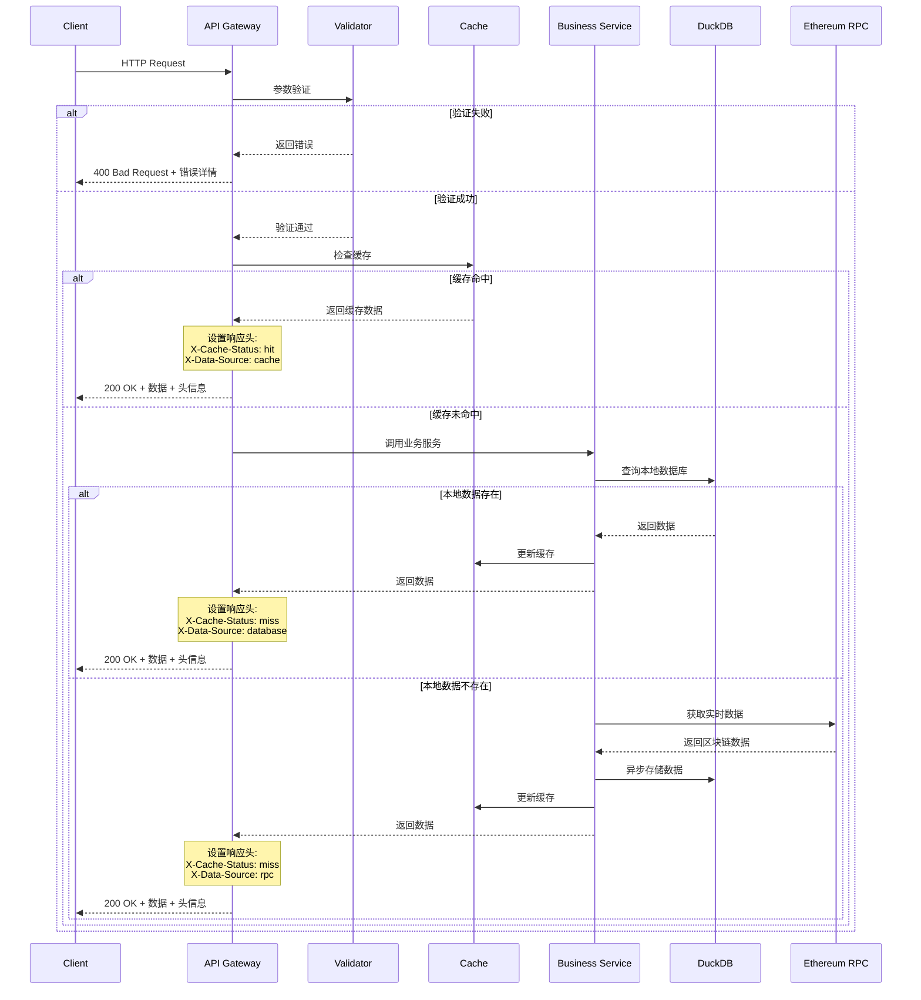

## 数据库设计

### 数据模型

### 统一数据库设计

#### 单一数据库策略
- **统一存储**：所有链的数据存储在同一个 `blockchain.db` 文件
- **链维度分区**：通过 `chain_id` 字段实现逻辑分区
- **查询优化**：基于 `chain_id` 的索引优化跨链查询

#### 用户RPC配置表
```sql
-- 用户自定义RPC配置（可选，不配置则使用viem默认）
CREATE TABLE user_rpc_configs (
    chain_id INTEGER PRIMARY KEY,
    custom_rpc_url VARCHAR(500),           -- 用户自定义RPC URL
    rpc_backup_urls JSON,                  -- 备用RPC端点数组
    timeout_ms INTEGER DEFAULT 10000,
    retry_count INTEGER DEFAULT 3,
    rate_limit INTEGER DEFAULT 100,
    created_at TIMESTAMP DEFAULT CURRENT_TIMESTAMP,
    updated_at TIMESTAMP DEFAULT CURRENT_TIMESTAMP
);
```

#### 核心数据表

##### 索引状态表
```sql
CREATE TABLE index_status (
    chain_id INTEGER NOT NULL,              -- 链ID
    type VARCHAR(20) NOT NULL,               -- 'block', 'address', 'token'
    identifier VARCHAR(66) NOT NULL,        -- 区块号、地址、代币合约地址
    indexed_at TIMESTAMP DEFAULT CURRENT_TIMESTAMP,
    last_updated TIMESTAMP DEFAULT CURRENT_TIMESTAMP,
    PRIMARY KEY (chain_id, type, identifier)
);
```

##### 区块表
```sql
CREATE TABLE blocks (
    chain_id INTEGER NOT NULL,                   -- 链ID（分区键）
    number BIGINT NOT NULL,                      -- 区块号
    hash VARCHAR(66) NOT NULL,                   -- 区块哈希
    parent_hash VARCHAR(66),                     -- 父区块哈希
    timestamp TIMESTAMP,                         -- 时间戳
    miner VARCHAR(42),                          -- 矿工地址（验证者地址）
    gas_limit BIGINT,                           -- Gas限制
    gas_used BIGINT,                            -- 已使用Gas
    base_fee_per_gas BIGINT,                    -- EIP-1559基础费用（如果支持）
    transaction_count INTEGER,                   -- 交易数量
    size_bytes INTEGER,                         -- 区块大小
    difficulty VARCHAR(32),                     -- 难度值（PoW链）
    total_difficulty VARCHAR(32),               -- 总难度（PoW链）
    extra_data TEXT,                            -- 额外数据
    logs_bloom TEXT,                            -- 日志布隆过滤器
    state_root VARCHAR(66),                     -- 状态根
    transactions_root VARCHAR(66),              -- 交易根
    receipts_root VARCHAR(66),                  -- 收据根
    indexed_at TIMESTAMP DEFAULT CURRENT_TIMESTAMP,  -- 索引时间
    PRIMARY KEY (chain_id, number),
    UNIQUE (chain_id, hash)
);

-- 多链索引
CREATE INDEX idx_blocks_chain_timestamp ON blocks(chain_id, timestamp DESC);
CREATE INDEX idx_blocks_chain_miner ON blocks(chain_id, miner);
CREATE INDEX idx_blocks_hash ON blocks(hash);
```

##### 交易表
```sql
CREATE TABLE transactions (
    chain_id INTEGER NOT NULL,                  -- 链ID（分区键）
    hash VARCHAR(66) NOT NULL,                  -- 交易哈希
    block_number BIGINT,                        -- 区块号
    transaction_index INTEGER,                  -- 交易索引
    from_address VARCHAR(42),                   -- 发送方地址
    to_address VARCHAR(42),                     -- 接收方地址（创建合约时为NULL）
    value DECIMAL(38,0),                        -- 转账金额
    gas_limit BIGINT,                           -- Gas限制
    gas_price BIGINT,                           -- Gas价格（Legacy交易）
    max_fee_per_gas BIGINT,                     -- 最大费用（EIP-1559）
    max_priority_fee_per_gas BIGINT,            -- 最大优先费用（EIP-1559）
    gas_used BIGINT,                            -- 实际使用Gas
    effective_gas_price BIGINT,                 -- 实际Gas价格
    status INTEGER,                             -- 交易状态（0=失败，1=成功）
    type INTEGER DEFAULT 0,                     -- 交易类型（0=Legacy，1=AccessList，2=EIP1559）
    nonce BIGINT,                               -- 账户nonce
    input_data TEXT,                            -- 输入数据
    logs_count INTEGER DEFAULT 0,               -- 日志数量
    contract_address VARCHAR(42),               -- 创建的合约地址（如果是合约创建）
    cumulative_gas_used BIGINT,                 -- 累计Gas使用量
    timestamp TIMESTAMP,                        -- 时间戳
    indexed_at TIMESTAMP DEFAULT CURRENT_TIMESTAMP,  -- 索引时间
    PRIMARY KEY (chain_id, hash),
    UNIQUE (chain_id, block_number, transaction_index)
);

-- 多链索引
CREATE INDEX idx_transactions_chain_block ON transactions(chain_id, block_number);
CREATE INDEX idx_transactions_chain_from ON transactions(chain_id, from_address);
CREATE INDEX idx_transactions_chain_to ON transactions(chain_id, to_address);
CREATE INDEX idx_transactions_chain_timestamp ON transactions(chain_id, timestamp DESC);
CREATE INDEX idx_transactions_hash ON transactions(hash);
```

##### 地址索引表
```sql
CREATE TABLE indexed_addresses (
    chain_id INTEGER NOT NULL,                  -- 链ID
    address VARCHAR(42) NOT NULL,               -- 地址
    label VARCHAR(100),                         -- 用户自定义标签
    first_seen_block BIGINT,                    -- 首次出现区块
    last_seen_block BIGINT,                     -- 最后出现区块
    transaction_count INTEGER DEFAULT 0,        -- 交易次数
    indexed_at TIMESTAMP DEFAULT CURRENT_TIMESTAMP,     -- 首次索引时间
    last_queried TIMESTAMP DEFAULT CURRENT_TIMESTAMP,   -- 最后查询时间
    PRIMARY KEY (chain_id, address)
);

-- 多链地址索引
CREATE INDEX idx_indexed_addresses_chain_queried ON indexed_addresses(chain_id, last_queried DESC);
CREATE INDEX idx_indexed_addresses_global ON indexed_addresses(address); -- 跨链地址查询
```

##### 搜索历史表
```sql
CREATE TABLE search_history (
    id INTEGER PRIMARY KEY AUTOINCREMENT,
    chain_id INTEGER,                           -- 链ID（可选，跨链搜索时为NULL）
    query VARCHAR(100) NOT NULL,                -- 搜索关键词
    result_type VARCHAR(20),                     -- 'block', 'transaction', 'address'
    result_id VARCHAR(66),                       -- 结果ID
    searched_at TIMESTAMP DEFAULT CURRENT_TIMESTAMP
);

CREATE INDEX idx_search_history_chain ON search_history(chain_id, searched_at DESC);
```

##### 用户偏好表
```sql
CREATE TABLE user_preferences (
    key VARCHAR(50) PRIMARY KEY,                 -- 配置键
    value TEXT,                                  -- 配置值
    updated_at TIMESTAMP DEFAULT CURRENT_TIMESTAMP
);
```

##### 访问历史表
```sql
CREATE TABLE access_history (
    chain_id INTEGER NOT NULL,                  -- 链ID
    type VARCHAR(20) NOT NULL,                  -- 'block', 'address', 'transaction'
    identifier VARCHAR(66) NOT NULL,           -- 区块号、地址、交易哈希
    first_accessed TIMESTAMP DEFAULT CURRENT_TIMESTAMP,
    last_accessed TIMESTAMP DEFAULT CURRENT_TIMESTAMP,
    access_count INTEGER DEFAULT 1,
    PRIMARY KEY (chain_id, type, identifier)
);

CREATE INDEX idx_access_history_chain_type ON access_history(chain_id, type, last_accessed DESC);
CREATE INDEX idx_access_history_count ON access_history(access_count DESC);
```

#### 查询优化策略

##### 多链查询优化
```sql
-- 跨链查询（按哈希查找）
SELECT * FROM transactions WHERE hash = ?;  -- 利用全局hash索引

-- 链内查询（大部分场景）
SELECT * FROM blocks 
WHERE chain_id = ? AND timestamp > ?
ORDER BY number DESC LIMIT 20;  -- 利用chain_id + timestamp索引

-- 地址跨链查询
SELECT chain_id, address, transaction_count 
FROM indexed_addresses 
WHERE address = ?;  -- 查看地址在哪些链上活跃
```

##### 分区查询示例
```sql
-- 获取特定链的最新区块
SELECT * FROM blocks 
WHERE chain_id = 1 
ORDER BY number DESC LIMIT 10;

-- 获取地址在特定链上的交易
SELECT t.*, b.timestamp 
FROM transactions t
JOIN blocks b ON t.chain_id = b.chain_id AND t.block_number = b.number
WHERE t.chain_id = 1 AND (t.from_address = ? OR t.to_address = ?)
ORDER BY b.timestamp DESC
LIMIT 20;

-- 跨链统计查询
SELECT 
    chain_id,
    COUNT(*) as tx_count,
    AVG(gas_price) as avg_gas_price
FROM transactions 
WHERE timestamp > date('now', '-1 day')
GROUP BY chain_id;
```

#### 数据清理策略

```sql
-- 定期清理旧的搜索历史（保留最近30天）
DELETE FROM search_history 
WHERE searched_at < datetime('now', '-30 days');

-- 清理长期未查询的地址索引（按链清理）
DELETE FROM indexed_addresses 
WHERE last_queried < datetime('now', '-90 days')
AND chain_id IN (SELECT chain_id FROM user_rpc_configs WHERE custom_rpc_url IS NULL);

-- 清理过期的索引状态
DELETE FROM index_status 
WHERE last_updated < datetime('now', '-7 days') 
AND type = 'temp';

-- 清理低活跃度链的访问历史
DELETE FROM access_history 
WHERE last_accessed < datetime('now', '-60 days')
AND access_count < 5;
```

### 数据分区策略

```sql
-- 按月分区交易表（DuckDB暂不支持，考虑应用层分区）
-- 大表查询优化策略
CREATE VIEW recent_transactions AS 
SELECT * FROM transactions 
WHERE timestamp > (CURRENT_TIMESTAMP - INTERVAL '30 days');

CREATE VIEW recent_token_transfers AS 
SELECT * FROM token_transfers 
WHERE timestamp > (CURRENT_TIMESTAMP - INTERVAL '30 days');
```

### 数据获取策略

#### 1. 实时数据（浏览器直接RPC）
- **最新区块信息**：直接从 RPC 获取
- **实时余额查询**：直接调用 RPC
- **交易状态**：直接查询 RPC
- **Gas 价格**：实时从 RPC 获取

#### 2. 历史数据（本地按需索引）
- **用户搜索的区块**：首次搜索时索引并存储
- **用户查询的地址**：按需索引交易历史
- **统计数据**：基于已索引数据计算
- **搜索建议**：基于历史查询记录

#### 3. 轻量级缓存
- **内存缓存**：简单的 Map 结构，存储热点数据
- **浏览器缓存**：静态资源和短期 API 响应
- **本地存储**：用户偏好和搜索历史

### 按需索引实现

```typescript
// 按需索引服务
class OnDemandIndexService {
  private indexedBlocks = new Set<number>();
  private indexedAddresses = new Set<string>();
  
  // 按需索引区块
  async indexBlockIfNeeded(blockNumber: number): Promise<void> {
    if (this.indexedBlocks.has(blockNumber)) {
      return; // 已索引，跳过
    }
    
    // 从 RPC 获取区块数据
    const block = await ethereumClient.getBlock(BigInt(blockNumber));
    
    // 存储到本地数据库
    await this.storeBlock(block);
    
    // 标记为已索引
    this.indexedBlocks.add(blockNumber);
  }
  
  // 按需索引地址交易
  async indexAddressTransactions(address: string, fromBlock?: number): Promise<void> {
    if (this.indexedAddresses.has(address)) {
      return; // 已索引
    }
    
    // 使用 RPC 查询地址相关交易（或第三方API）
    const transactions = await this.getAddressTransactions(address, fromBlock);
    
    // 存储相关区块和交易
    for (const tx of transactions) {
      await this.indexBlockIfNeeded(tx.blockNumber);
    }
    
    this.indexedAddresses.add(address);
  }
  
  private memoryCache = new Map<string, { data: any; expires: number }>();
  
  // 简单内存缓存
  cache(key: string, data: any, ttlSeconds = 300): void {
    this.memoryCache.set(key, {
      data,
      expires: Date.now() + ttlSeconds * 1000
    });
  }
  
  getCache(key: string): any | null {
    const cached = this.memoryCache.get(key);
    if (!cached || cached.expires < Date.now()) {
      this.memoryCache.delete(key);
      return null;
    }
    return cached.data;
  }
}
```

## 性能优化

### 数据库优化

#### 查询优化
```sql
-- 优化最新区块查询
SELECT * FROM blocks 
ORDER BY number DESC 
LIMIT 20;

-- 优化地址交易历史查询
SELECT t.*, b.timestamp 
FROM transactions t
JOIN blocks b ON t.block_number = b.number
WHERE t.from_address = ? OR t.to_address = ?
ORDER BY b.timestamp DESC
LIMIT 20 OFFSET ?;

-- 优化统计查询
SELECT 
    DATE_TRUNC('day', timestamp) as date,
    COUNT(*) as transaction_count,
    AVG(gas_price) as avg_gas_price
FROM transactions 
WHERE timestamp >= CURRENT_DATE - INTERVAL '30 days'
GROUP BY DATE_TRUNC('day', timestamp)
ORDER BY date;
```

#### 存储优化
```sql
-- 数据压缩设置
PRAGMA memory_limit='2GB';
PRAGMA temp_directory='/tmp/duckdb_temp';

-- 预聚合表创建
CREATE TABLE daily_stats AS
SELECT 
    DATE_TRUNC('day', timestamp) as date,
    COUNT(*) as tx_count,
    AVG(gas_price) as avg_gas_price,
    SUM(gas_used) as total_gas_used,
    COUNT(DISTINCT from_address) as active_addresses
FROM transactions
GROUP BY DATE_TRUNC('day', timestamp);
```

### API优化

#### 响应优化
```typescript
// 分页优化
type PaginationParams = {
  page: number;
  limit: number;
  cursor?: string; // 游标分页，适用于大数据集
};

// 字段选择
type FieldSelection = {
  select?: string[]; // 只返回指定字段
  exclude?: string[]; // 排除指定字段
};

// 批量查询
type BatchQuery = {
  queries: Array<{
    type: 'block' | 'transaction' | 'address';
    params: any;
  }>;
};
```

#### 连接池优化
```typescript
// 数据库连接池配置
const dbConfig = {
  maxConnections: 10,
  idleTimeout: 30000,
  acquireTimeout: 60000,
  retryAttempts: 3,
};

// 查询超时设置
const queryTimeout = {
  simple: 5000,    // 简单查询5秒超时
  complex: 30000,  // 复杂查询30秒超时
  batch: 60000,    // 批量查询60秒超时
};
```

## 监控告警

### 系统监控指标

#### 性能指标
- **响应时间**：API接口平均响应时间
- **吞吐量**：每秒处理请求数量
- **错误率**：4xx/5xx错误请求比例
- **数据库性能**：查询执行时间、连接数

#### 业务指标
- **同步延迟**：与最新区块的差距
- **数据完整性**：丢失区块或交易检查
- **缓存命中率**：各级缓存命中情况
- **用户活跃度**：日活、页面访问量

### 告警策略

```typescript
// 告警规则配置
const alertRules = {
  // 系统告警
  system: {
    highResponseTime: { threshold: 2000, duration: '5m' },
    highErrorRate: { threshold: 0.05, duration: '3m' },
    lowMemory: { threshold: 0.1, duration: '1m' },
    highCpuUsage: { threshold: 0.8, duration: '5m' },
  },
  
  // 业务告警
  business: {
    syncDelay: { threshold: 10, duration: '2m' },      // 同步延迟超过10个区块
    lowCacheHitRate: { threshold: 0.7, duration: '10m' }, // 缓存命中率低于70%
    dataInconsistency: { threshold: 1, duration: '0m' },   // 数据不一致立即告警
  }
};
```

## 安全设计

### 输入验证

```typescript
// 地址验证
const isValidAddress = (address: string): boolean => {
  return /^0x[a-fA-F0-9]{40}$/.test(address);
};

// 交易哈希验证
const isValidTxHash = (hash: string): boolean => {
  return /^0x[a-fA-F0-9]{64}$/.test(hash);
};

// 区块号验证
const isValidBlockNumber = (blockNumber: string): boolean => {
  const num = parseInt(blockNumber, 10);
  return !isNaN(num) && num >= 0 && num <= Number.MAX_SAFE_INTEGER;
};
```

### 访问控制

```typescript
// 速率限制配置
const rateLimitConfig = {
  global: { max: 1000, window: '15m' },      // 全局限制
  ip: { max: 100, window: '1m' },            // IP限制
  endpoint: {
    search: { max: 30, window: '1m' },       // 搜索接口限制
    stats: { max: 10, window: '1m' },        // 统计接口限制
  }
};

// CORS配置
const corsConfig = {
  origin: process.env.ALLOWED_ORIGINS?.split(',') || ['*'],
  methods: ['GET', 'POST'],
  allowedHeaders: ['Content-Type', 'Authorization'],
  maxAge: 86400, // 预检请求缓存24小时
};
```

### 数据安全

```typescript
// SQL注入防护
const sanitizeQuery = (query: string): string => {
  // 使用参数化查询，不直接拼接SQL
  return query.replace(/[^\w\s]/gi, '');
};

// XSS防护
const sanitizeOutput = (data: any): any => {
  if (typeof data === 'string') {
    return data.replace(/[<>\"']/g, '');
  }
  return data;
};
```

## 部署架构

### 开发环境

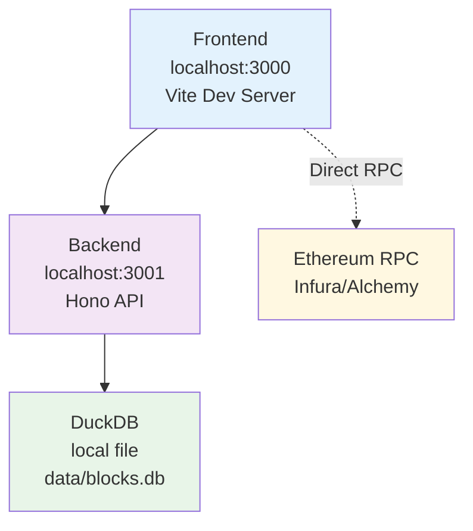

### 生产环境

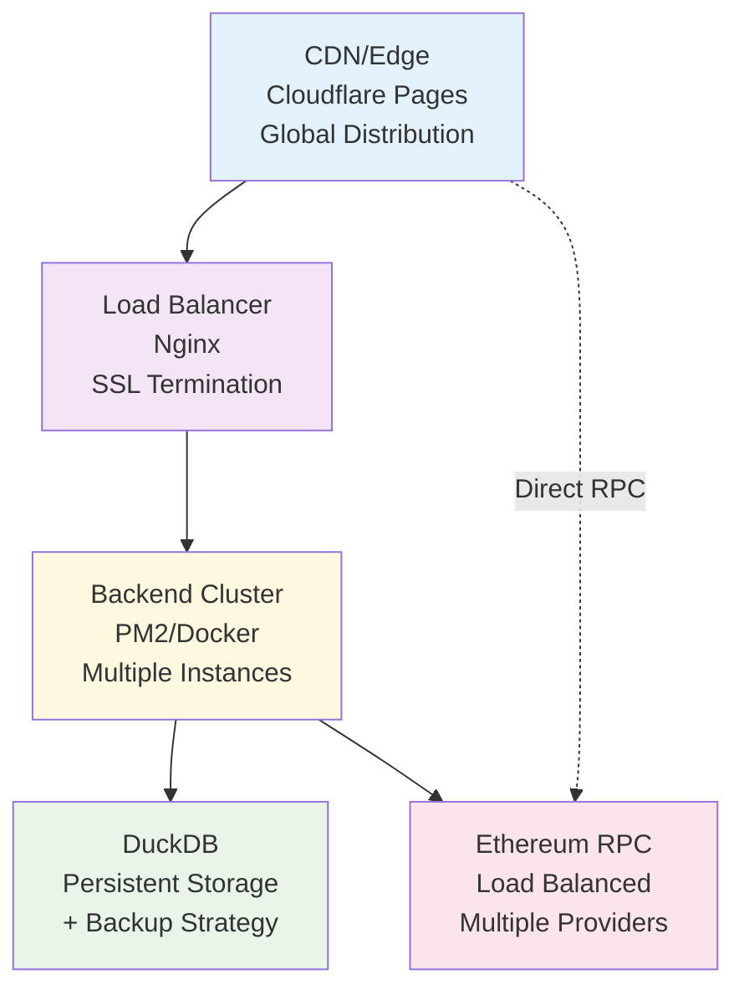

### 容器化部署

```dockerfile
# backend/Dockerfile
FROM node:22-alpine

WORKDIR /app
COPY package*.json ./
RUN npm ci --only=production

COPY dist ./dist
COPY data ./data

EXPOSE 3001
CMD ["node", "dist/app.js"]
```

```yaml
# docker-compose.yml
version: '3.8'
services:
  backend:
    build: ./backend
    ports:
      - "3001:3001"
    volumes:
      - ./data:/app/data
    environment:
      - NODE_ENV=production
      - DATABASE_PATH=/app/data/blockchain.duckdb
    restart: unless-stopped
    
  nginx:
    image: nginx:alpine
    ports:
      - "80:80"
      - "443:443"
    volumes:
      - ./nginx.conf:/etc/nginx/nginx.conf
      - ./ssl:/etc/nginx/ssl
    depends_on:
      - backend
    restart: unless-stopped
```

## 扩展规划

### 水平扩展

#### 读写分离

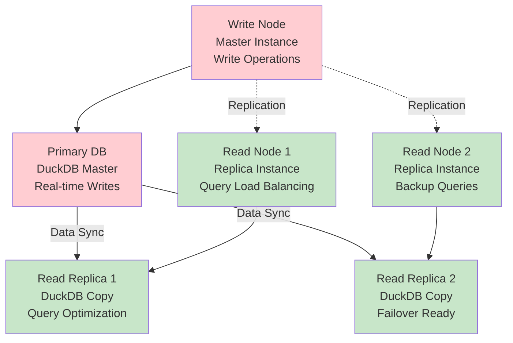

#### 分片策略
- **按时间分片**：不同时间段的数据存储在不同节点
- **按数据类型分片**：区块、交易、地址数据分别存储
- **按负载分片**：根据访问频率分配存储

### 功能扩展

#### 多链支持
- **链抽象层**：统一的区块链接口
- **配置化**：通过配置支持新链
- **数据隔离**：不同链的数据独立存储

#### 高级分析
- **DeFi协议支持**：DEX、借贷、流动性挖矿
- **NFT追踪**：NFT交易、持有、价格趋势
- **MEV分析**：MEV机器人、套利交易识别
- **智能合约分析**：合约调用关系、Gas优化建议

---

本架构设计文档将随着项目发展持续更新和完善。
