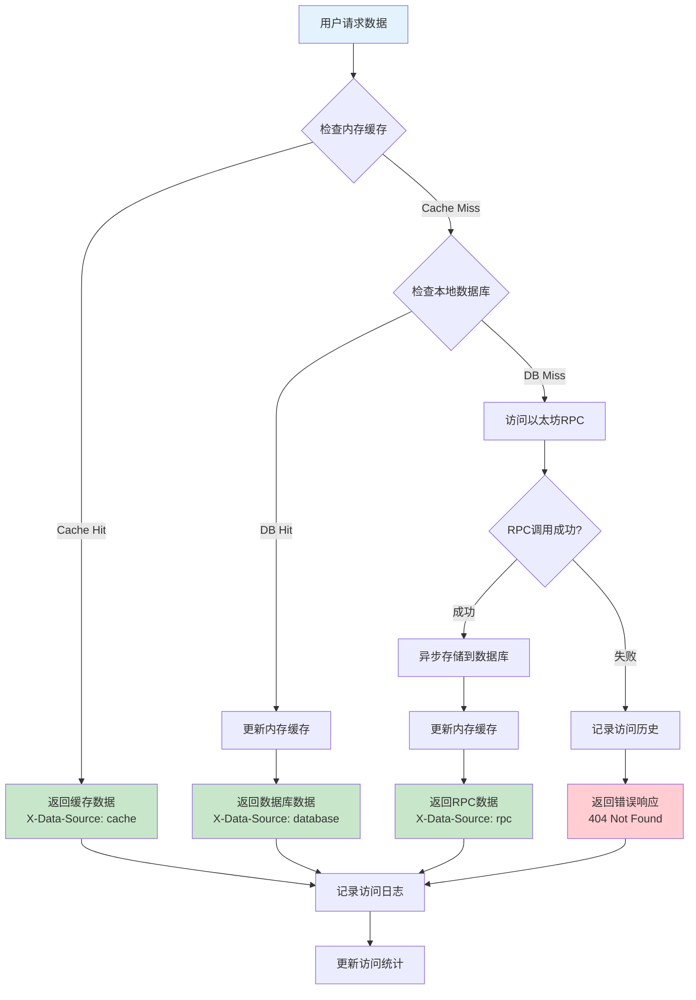

# 数据获取策略文档

## 概述

本文档详细说明了区块链浏览器的按需数据获取策略。系统采用"用户访问时同步"的理念，无定时任务，完全基于用户行为驱动数据获取和存储。

## 数据分类

### 1. 统一数据访问策略

所有数据访问统一通过后端API，后端负责与RPC节点通信，前端不直接暴露RPC配置。

#### 配置驱动的RPC客户端
```typescript
// src/server/services/RpcClientManager.ts
import { createPublicClient, http } from 'viem';
import { mainnet, polygon, bsc, arbitrum, base } from 'viem/chains';
import { ConfigService } from './ConfigService';

export class RpcClientManager {
  private clients = new Map<number, ReturnType<typeof createPublicClient>>();
  private configService: ConfigService;

  constructor(configService: ConfigService) {
    this.configService = configService;
  }

  async getClient(chainId: number) {
    if (!this.clients.has(chainId)) {
      const chainConfig = await this.configService.getChainConfig(chainId);
      const client = this.createClient(chainConfig);
      this.clients.set(chainId, client);
    }
    return this.clients.get(chainId)!;
  }

  private createClient(chainConfig: ChainConfig) {
    const viemChain = this.getViemChain(chainConfig.chainId);
    
    return createPublicClient({
      chain: viemChain,
      transport: http(chainConfig.rpcUrl, {
        timeout: chainConfig.timeout || 10000,
        retryCount: chainConfig.retryCount || 3,
      }),
    });
  }

  private getViemChain(chainId: number) {
    // 使用 viem 内置的链定义
    const chainMap = {
      1: mainnet,
      137: polygon,
      56: bsc, 
      42161: arbitrum,
      8453: base,
    };
    
    return chainMap[chainId] || mainnet;
  }
}
```

#### 实时数据获取（通过API）
```typescript
// src/client/api/realTimeApi.ts
export class RealTimeApi {
  private baseUrl: string;

  constructor(baseUrl: string) {
    this.baseUrl = baseUrl;
  }

  async getLatestBlock(chainId: number) {
    const response = await fetch(`${this.baseUrl}/api/chains/${chainId}/blocks/latest`);
    return await response.json();
  }

  async getBalance(chainId: number, address: string) {
    const response = await fetch(`${this.baseUrl}/api/chains/${chainId}/addresses/${address}/balance`);
    return await response.json();
  }

  async getGasPrice(chainId: number) {
    const response = await fetch(`${this.baseUrl}/api/chains/${chainId}/gas`);
    return await response.json();
  }

  async getTransactionStatus(chainId: number, hash: string) {
    const response = await fetch(`${this.baseUrl}/api/chains/${chainId}/transactions/${hash}`);
    return await response.json();
  }
}
```

## 配置管理系统

### 数据库配置存储

所有配置信息存储在本地DuckDB中，用户可通过界面进行管理。

#### 配置数据表结构
```sql
-- 链配置表
CREATE TABLE chain_configs (
    chain_id INTEGER PRIMARY KEY,
    name VARCHAR NOT NULL,
    symbol VARCHAR NOT NULL,
    rpc_url VARCHAR NOT NULL,
    rpc_backup_urls JSON,  -- 备用RPC端点数组
    explorer_url VARCHAR,
    block_time INTEGER DEFAULT 12,
    enabled BOOLEAN DEFAULT TRUE,
    timeout_ms INTEGER DEFAULT 10000,
    retry_count INTEGER DEFAULT 3,
    rate_limit INTEGER DEFAULT 100,  -- 每秒请求限制
    created_at TIMESTAMP DEFAULT CURRENT_TIMESTAMP,
    updated_at TIMESTAMP DEFAULT CURRENT_TIMESTAMP
);

-- 应用配置表
CREATE TABLE app_configs (
    key VARCHAR PRIMARY KEY,
    value JSON NOT NULL,
    description VARCHAR,
    category VARCHAR DEFAULT 'general',
    created_at TIMESTAMP DEFAULT CURRENT_TIMESTAMP,
    updated_at TIMESTAMP DEFAULT CURRENT_TIMESTAMP
);

-- RPC性能统计表
CREATE TABLE rpc_performance (
    chain_id INTEGER,
    rpc_url VARCHAR,
    avg_response_time INTEGER,  -- 平均响应时间(ms)
    success_rate DECIMAL(5,2),  -- 成功率
    last_check TIMESTAMP DEFAULT CURRENT_TIMESTAMP,
    PRIMARY KEY (chain_id, rpc_url)
);
```

#### 配置服务
```typescript
// src/server/services/ConfigService.ts
import { Database } from 'duckdb-async';
import { mainnet, polygon, bsc, arbitrum, base, optimism } from 'viem/chains';

export type ChainConfig = {
  chainId: number;
  name: string;
  symbol: string;
  rpcUrl: string;
  rpcBackupUrls: string[];
  explorerUrl: string;
  blockTime: number;
  enabled: boolean;
  timeout: number;
  retryCount: number;
  rateLimit: number;
};

export type AppConfig = {
  key: string;
  value: any;
  description?: string;
  category: string;
};

export class ConfigService {
  private db: Database;

  constructor(db: Database) {
    this.db = db;
    this.initializeDefaultConfigs();
  }

  // 初始化默认配置
  private async initializeDefaultConfigs() {
    const existingChains = await this.db.all('SELECT chain_id FROM chain_configs');
    
    if (existingChains.length === 0) {
      // 使用 viem 内置链定义初始化默认配置
      const defaultChains = this.getDefaultChainConfigs();
      
      for (const chain of defaultChains) {
        await this.saveChainConfig(chain);
      }
    }
  }

  private getDefaultChainConfigs(): ChainConfig[] {
    // 基于 viem 的链定义创建默认配置
    return [
      {
        chainId: mainnet.id,
        name: mainnet.name,
        symbol: mainnet.nativeCurrency.symbol,
        rpcUrl: 'https://ethereum.publicnode.com',
        rpcBackupUrls: [
          'https://rpc.ankr.com/eth',
          'https://eth.llamarpc.com'
        ],
        explorerUrl: mainnet.blockExplorers?.default?.url || 'https://etherscan.io',
        blockTime: 12,
        enabled: true,
        timeout: 10000,
        retryCount: 3,
        rateLimit: 100
      },
      {
        chainId: polygon.id,
        name: polygon.name,
        symbol: polygon.nativeCurrency.symbol,
        rpcUrl: 'https://polygon-rpc.com',
        rpcBackupUrls: [
          'https://rpc.ankr.com/polygon'
        ],
        explorerUrl: polygon.blockExplorers?.default?.url || 'https://polygonscan.com',
        blockTime: 2,
        enabled: true,
        timeout: 10000,
        retryCount: 3,
        rateLimit: 100
      }
      // ... 其他链配置
    ];
  }

  // 获取链配置
  async getChainConfig(chainId: number): Promise<ChainConfig | null> {
    const row = await this.db.get(
      'SELECT * FROM chain_configs WHERE chain_id = ?',
      [chainId]
    );

    if (!row) return null;

    return {
      chainId: row.chain_id,
      name: row.name,
      symbol: row.symbol,
      rpcUrl: row.rpc_url,
      rpcBackupUrls: JSON.parse(row.rpc_backup_urls || '[]'),
      explorerUrl: row.explorer_url,
      blockTime: row.block_time,
      enabled: row.enabled,
      timeout: row.timeout_ms,
      retryCount: row.retry_count,
      rateLimit: row.rate_limit
    };
  }

  // 保存链配置
  async saveChainConfig(config: ChainConfig): Promise<void> {
    await this.db.run(`
      INSERT OR REPLACE INTO chain_configs (
        chain_id, name, symbol, rpc_url, rpc_backup_urls, 
        explorer_url, block_time, enabled, timeout_ms, 
        retry_count, rate_limit, updated_at
      ) VALUES (?, ?, ?, ?, ?, ?, ?, ?, ?, ?, ?, CURRENT_TIMESTAMP)
    `, [
      config.chainId,
      config.name,
      config.symbol,
      config.rpcUrl,
      JSON.stringify(config.rpcBackupUrls),
      config.explorerUrl,
      config.blockTime,
      config.enabled,
      config.timeout,
      config.retryCount,
      config.rateLimit
    ]);
  }

  // 获取所有启用的链
  async getEnabledChains(): Promise<ChainConfig[]> {
    const rows = await this.db.all(
      'SELECT * FROM chain_configs WHERE enabled = TRUE ORDER BY chain_id'
    );

    return rows.map(row => ({
      chainId: row.chain_id,
      name: row.name,
      symbol: row.symbol,
      rpcUrl: row.rpc_url,
      rpcBackupUrls: JSON.parse(row.rpc_backup_urls || '[]'),
      explorerUrl: row.explorer_url,
      blockTime: row.block_time,
      enabled: row.enabled,
      timeout: row.timeout_ms,
      retryCount: row.retry_count,
      rateLimit: row.rate_limit
    }));
  }

  // 应用配置管理
  async getAppConfig(key: string): Promise<any> {
    const row = await this.db.get(
      'SELECT value FROM app_configs WHERE key = ?',
      [key]
    );
    return row ? JSON.parse(row.value) : null;
  }

  async setAppConfig(key: string, value: any, description?: string, category = 'general'): Promise<void> {
    await this.db.run(`
      INSERT OR REPLACE INTO app_configs (key, value, description, category, updated_at)
      VALUES (?, ?, ?, ?, CURRENT_TIMESTAMP)
    `, [key, JSON.stringify(value), description, category]);
  }
}
```

## 页面配置管理界面

### 配置管理页面组件

```typescript
// src/client/pages/SettingsPage.tsx
import { useState, useEffect } from 'react';
import { ChainConfig, AppConfig } from '@/types/config';

export const SettingsPage = () => {
  const [chains, setChains] = useState<ChainConfig[]>([]);
  const [activeTab, setActiveTab] = useState<'chains' | 'rpc' | 'general'>('chains');

  useEffect(() => {
    loadChainConfigs();
  }, []);

  const loadChainConfigs = async () => {
    const response = await fetch('/api/admin/chains');
    const chainConfigs = await response.json();
    setChains(chainConfigs);
  };

  return (
    <div className="settings-page">
      <h1>系统设置</h1>
      
      <div className="settings-tabs">
        <button 
          className={activeTab === 'chains' ? 'active' : ''}
          onClick={() => setActiveTab('chains')}
        >
          链配置
        </button>
        <button 
          className={activeTab === 'rpc' ? 'active' : ''}
          onClick={() => setActiveTab('rpc')}
        >
          RPC设置
        </button>
        <button 
          className={activeTab === 'general' ? 'active' : ''}
          onClick={() => setActiveTab('general')}
        >
          通用设置
        </button>
      </div>

      <div className="settings-content">
        {activeTab === 'chains' && <ChainConfigPanel chains={chains} onUpdate={loadChainConfigs} />}
        {activeTab === 'rpc' && <RpcConfigPanel />}
        {activeTab === 'general' && <GeneralConfigPanel />}
      </div>
    </div>
  );
};
```

### 链配置面板

```typescript
// src/client/components/ChainConfigPanel.tsx
import { useState } from 'react';
import { ChainConfig } from '@/types/config';

type ChainConfigPanelProps = {
  chains: ChainConfig[];
  onUpdate: () => void;
};

export const ChainConfigPanel = ({ chains, onUpdate }: ChainConfigPanelProps) => {
  const [editingChain, setEditingChain] = useState<ChainConfig | null>(null);

  const handleSaveChain = async (config: ChainConfig) => {
    const response = await fetch(`/api/admin/chains/${config.chainId}`, {
      method: 'PUT',
      headers: { 'Content-Type': 'application/json' },
      body: JSON.stringify(config)
    });

    if (response.ok) {
      setEditingChain(null);
      onUpdate();
    }
  };

  const handleToggleChain = async (chainId: number, enabled: boolean) => {
    await fetch(`/api/admin/chains/${chainId}/toggle`, {
      method: 'PATCH',
      headers: { 'Content-Type': 'application/json' },
      body: JSON.stringify({ enabled })
    });
    onUpdate();
  };

  return (
    <div className="chain-config-panel">
      <div className="panel-header">
        <h2>支持的区块链</h2>
        <button onClick={() => setEditingChain({ 
          chainId: 0, name: '', symbol: '', rpcUrl: '', 
          rpcBackupUrls: [], explorerUrl: '', blockTime: 12, 
          enabled: true, timeout: 10000, retryCount: 3, rateLimit: 100 
        })}>
          添加新链
        </button>
      </div>

      <div className="chains-list">
        {chains.map(chain => (
          <div key={chain.chainId} className="chain-item">
            <div className="chain-info">
              <div className="chain-header">
                <span className="chain-name">{chain.name} ({chain.symbol})</span>
                <div className="chain-controls">
                  <label className="toggle-switch">
                    <input
                      type="checkbox"
                      checked={chain.enabled}
                      onChange={(e) => handleToggleChain(chain.chainId, e.target.checked)}
                    />
                    <span className="slider"></span>
                  </label>
                  <button onClick={() => setEditingChain(chain)}>编辑</button>
                </div>
              </div>
              
              <div className="chain-details">
                <div>链ID: {chain.chainId}</div>
                <div>RPC: {chain.rpcUrl}</div>
                <div>出块时间: {chain.blockTime}s</div>
                <div>状态: {chain.enabled ? '已启用' : '已禁用'}</div>
              </div>
            </div>
          </div>
        ))}
      </div>

      {editingChain && (
        <ChainEditModal
          chain={editingChain}
          onSave={handleSaveChain}
          onCancel={() => setEditingChain(null)}
        />
      )}
    </div>
  );
};
```

### RPC配置面板

```typescript
// src/client/components/RpcConfigPanel.tsx
import { useState, useEffect } from 'react';

type RpcPerformance = {
  chainId: number;
  rpcUrl: string;
  avgResponseTime: number;
  successRate: number;
  lastCheck: string;
};

export const RpcConfigPanel = () => {
  const [performance, setPerformance] = useState<RpcPerformance[]>([]);
  const [testingRpc, setTestingRpc] = useState<string | null>(null);

  useEffect(() => {
    loadRpcPerformance();
  }, []);

  const loadRpcPerformance = async () => {
    const response = await fetch('/api/admin/rpc/performance');
    const data = await response.json();
    setPerformance(data);
  };

  const testRpcEndpoint = async (chainId: number, rpcUrl: string) => {
    setTestingRpc(rpcUrl);
    
    try {
      const response = await fetch('/api/admin/rpc/test', {
        method: 'POST',
        headers: { 'Content-Type': 'application/json' },
        body: JSON.stringify({ chainId, rpcUrl })
      });
      
      const result = await response.json();
      
      // 更新性能数据
      loadRpcPerformance();
      
      alert(`测试结果:\n响应时间: ${result.responseTime}ms\n状态: ${result.success ? '成功' : '失败'}`);
    } catch (error) {
      alert('测试失败: ' + error.message);
    } finally {
      setTestingRpc(null);
    }
  };

  const addCustomRpc = async (chainId: number) => {
    const rpcUrl = prompt('请输入RPC URL:');
    if (!rpcUrl) return;

    try {
      const response = await fetch(`/api/admin/chains/${chainId}/rpc`, {
        method: 'POST',
        headers: { 'Content-Type': 'application/json' },
        body: JSON.stringify({ rpcUrl })
      });

      if (response.ok) {
        loadRpcPerformance();
        alert('RPC端点已添加');
      }
    } catch (error) {
      alert('添加失败: ' + error.message);
    }
  };

  return (
    <div className="rpc-config-panel">
      <h2>RPC端点管理</h2>
      
      <div className="rpc-explanation">
        <p>💡 配置私有RPC端点以获得更快的响应速度和更高的请求限制</p>
        <p>🔒 所有配置保存在本地，确保您的API密钥安全</p>
      </div>

      <div className="rpc-performance">
        <h3>RPC性能监控</h3>
        <table>
          <thead>
            <tr>
              <th>链</th>
              <th>RPC URL</th>
              <th>平均响应时间</th>
              <th>成功率</th>
              <th>最后检查</th>
              <th>操作</th>
            </tr>
          </thead>
          <tbody>
            {performance.map((item, index) => (
              <tr key={index}>
                <td>{item.chainId}</td>
                <td className="rpc-url">{item.rpcUrl}</td>
                <td className={item.avgResponseTime > 1000 ? 'slow' : 'fast'}>
                  {item.avgResponseTime}ms
                </td>
                <td className={item.successRate < 90 ? 'poor' : 'good'}>
                  {item.successRate.toFixed(1)}%
                </td>
                <td>{new Date(item.lastCheck).toLocaleString()}</td>
                <td>
                  <button
                    onClick={() => testRpcEndpoint(item.chainId, item.rpcUrl)}
                    disabled={testingRpc === item.rpcUrl}
                  >
                    {testingRpc === item.rpcUrl ? '测试中...' : '测试'}
                  </button>
                </td>
              </tr>
            ))}
          </tbody>
        </table>
      </div>

      <div className="quick-setup">
        <h3>快速设置</h3>
        <div className="setup-cards">
          <div className="setup-card">
            <h4>Alchemy</h4>
            <p>专业的以太坊基础设施服务</p>
            <button onClick={() => window.open('https://www.alchemy.com/', '_blank')}>
              获取API Key
            </button>
          </div>
          
          <div className="setup-card">
            <h4>Infura</h4>
            <p>可靠的区块链开发平台</p>
            <button onClick={() => window.open('https://infura.io/', '_blank')}>
              获取API Key
            </button>
          </div>
          
          <div className="setup-card">
            <h4>QuickNode</h4>
            <p>全球化的区块链基础设施</p>
            <button onClick={() => window.open('https://www.quicknode.com/', '_blank')}>
              获取API Key
            </button>
          </div>
        </div>
      </div>
    </div>
  );
};
```

### 2. 历史数据（本地按需索引）

对于历史数据和复杂查询，使用本地DuckDB进行按需索引：

#### 数据获取流程图



#### 按需索引流程
```typescript
// src/server/services/OnDemandIndexService.ts
export class OnDemandIndexService {
  private db: DatabaseConnection;
  private ethereumClient: EthereumClient;
  private cache: Map<string, { data: any; expires: number }> = new Map();
  
  // 检查数据是否已缓存或存储
  async getBlockData(blockNumber: number, includeTransactions = false): Promise<Block | null> {
    const cacheKey = \`block:\${blockNumber}:\${includeTransactions}\`;
    
    // 1. 检查内存缓存
    const cached = this.getFromCache(cacheKey);
    if (cached) {
      return cached;
    }
    
    // 2. 检查本地数据库
    const stored = await this.getStoredBlock(blockNumber, includeTransactions);
    if (stored) {
      this.setCache(cacheKey, stored, 3600); // 缓存1小时
      return stored;
    }
    
    // 3. 实时从RPC获取（用户访问时同步）
    try {
      const block = await this.fetchBlockFromRPC(blockNumber, includeTransactions);
      
      // 异步存储到本地数据库（不阻塞响应）
      this.storeBlockAsync(block);
      
      // 缓存
      this.setCache(cacheKey, block, 300); // 缓存5分钟
      
      return block;
    } catch (error) {
      console.error(\`Failed to fetch block \${blockNumber}:\`, error);
      return null;
    }
  }
  
  // 按需获取地址交易历史
  async getAddressTransactions(
    address: string, 
    page = 1, 
    limit = 20
  ): Promise<{ transactions: Transaction[]; total: number }> {
    const cacheKey = \`addr:\${address}:page:\${page}:limit:\${limit}\`;
    
    // 检查缓存
    const cached = this.getFromCache(cacheKey);
    if (cached) {
      return cached;
    }
    
    // 检查本地存储
    const stored = await this.getStoredAddressTransactions(address, page, limit);
    
    if (stored.transactions.length > 0) {
      this.setCache(cacheKey, stored, 600); // 缓存10分钟
      return stored;
    }
    
    // 实时获取（仅在用户访问时）
    try {
      // 使用第三方API或扫描获取地址交易
      const transactions = await this.fetchAddressTransactionsFromAPI(address, page, limit);
      
      // 异步存储相关的区块和交易
      this.indexAddressDataAsync(address, transactions);
      
      const result = { transactions, total: transactions.length };
      this.setCache(cacheKey, result, 300); // 缓存5分钟
      
      return result;
    } catch (error) {
      console.error(\`Failed to fetch address transactions \${address}:\`, error);
      return { transactions: [], total: 0 };
    }
  }
  
  // 按需索引地址交易历史
  async indexAddressTransactions(address: string, fromBlock?: number): Promise<void> {
    const isIndexed = await this.isAddressIndexed(address);
    if (isIndexed) {
      await this.updateLastQueried(address);
      return;
    }
    
    try {
      // 使用第三方API或者扫描方式获取地址相关交易
      const transactions = await this.getAddressTransactions(address, fromBlock);
      
      // 索引相关的区块和交易
      for (const tx of transactions) {
        await this.indexBlock(tx.blockNumber);
      }
      
      // 记录地址索引信息
      await this.recordAddressIndex(address, transactions);
      
    } catch (error) {
      console.error(\`Failed to index address \${address}:\`, error);
      throw error;
    }
  }
  
  // 异步存储区块数据（不阻塞用户响应）
  private async storeBlockAsync(block: Block): Promise<void> {
    setImmediate(async () => {
      try {
        await this.db.run(\`
          INSERT OR REPLACE INTO blocks (
            number, hash, parent_hash, timestamp, miner,
            gas_limit, gas_used, base_fee_per_gas, transaction_count, size_bytes
          ) VALUES (?, ?, ?, ?, ?, ?, ?, ?, ?, ?)
        \`, [
          block.number,
          block.hash,
          block.parentHash,
          block.timestamp,
          block.miner,
          Number(block.gasLimit),
          Number(block.gasUsed),
          block.baseFeePerGas ? Number(block.baseFeePerGas) : null,
          block.transactionCount,
          block.size
        ]);
        
        // 记录访问历史
        await this.recordAccess('block', block.number.toString());
        
        console.log(\`✅ Block \${block.number} stored asynchronously\`);
      } catch (error) {
        console.error(\`❌ Failed to store block \${block.number}:\`, error);
      }
    });
  }
  
  // 异步索引地址数据
  private async indexAddressDataAsync(address: string, transactions: Transaction[]): Promise<void> {
    setImmediate(async () => {
      try {
        // 存储交易数据
        for (const tx of transactions) {
          await this.storeTransactionAsync(tx);
        }
        
        // 记录地址索引
        await this.recordAddressAccess(address);
        
        console.log(\`✅ Address \${address} data indexed asynchronously\`);
      } catch (error) {
        console.error(\`❌ Failed to index address \${address}:\`, error);
      }
    });
  }
  
  // 简单内存缓存管理
  private getFromCache(key: string): any | null {
    const cached = this.cache.get(key);
    if (!cached || cached.expires < Date.now()) {
      this.cache.delete(key);
      return null;
    }
    return cached.data;
  }
  
  private setCache(key: string, data: any, ttlSeconds: number): void {
    this.cache.set(key, {
      data,
      expires: Date.now() + ttlSeconds * 1000
    });
    
    // 定期清理过期缓存
    if (this.cache.size > 1000) {
      this.cleanupCache();
    }
  }
  
  private cleanupCache(): void {
    const now = Date.now();
    for (const [key, value] of this.cache.entries()) {
      if (value.expires < now) {
        this.cache.delete(key);
      }
    }
  }
  
  // 记录用户访问行为
  private async recordAccess(type: string, identifier: string): Promise<void> {
    await this.db.run(\`
      INSERT OR REPLACE INTO access_history (type, identifier, accessed_at, access_count)
      VALUES (?, ?, CURRENT_TIMESTAMP, 
        COALESCE((SELECT access_count FROM access_history WHERE type = ? AND identifier = ?), 0) + 1
      )
    \`, [type, identifier, type, identifier]);
  }
}
```

### 3. 智能缓存策略

#### 内存缓存（服务端）
```typescript
// src/server/services/CacheService.ts
export class SimpleCacheService {
  private cache = new Map<string, { data: any; expires: number }>();
  
  set(key: string, data: any, ttlSeconds = 300): void {
    this.cache.set(key, {
      data,
      expires: Date.now() + ttlSeconds * 1000
    });
  }
  
  get(key: string): any | null {
    const cached = this.cache.get(key);
    if (!cached || cached.expires < Date.now()) {
      this.cache.delete(key);
      return null;
    }
    return cached.data;
  }
  
  // 定期清理过期缓存
  cleanup(): void {
    const now = Date.now();
    for (const [key, value] of this.cache.entries()) {
      if (value.expires < now) {
        this.cache.delete(key);
      }
    }
  }
}
```

#### 浏览器缓存（前端）
```typescript
// src/client/lib/browserCache.ts
export class BrowserCache {
  private static CACHE_PREFIX = 'block-explorer:';
  
  static set(key: string, data: any, ttlMinutes = 5): void {
    const item = {
      data,
      expires: Date.now() + ttlMinutes * 60 * 1000
    };
    localStorage.setItem(
      this.CACHE_PREFIX + key, 
      JSON.stringify(item)
    );
  }
  
  static get(key: string): any | null {
    try {
      const cached = localStorage.getItem(this.CACHE_PREFIX + key);
      if (!cached) return null;
      
      const item = JSON.parse(cached);
      if (item.expires < Date.now()) {
        localStorage.removeItem(this.CACHE_PREFIX + key);
        return null;
      }
      
      return item.data;
    } catch {
      return null;
    }
  }
  
  static clear(): void {
    const keys = Object.keys(localStorage);
    keys.forEach(key => {
      if (key.startsWith(this.CACHE_PREFIX)) {
        localStorage.removeItem(key);
      }
    });
  }
}
```

## API设计策略

### 混合数据接口

```typescript
// src/server/routes/hybrid.ts
import { Hono } from 'hono';

const hybrid = new Hono();

// 获取区块信息（优先本地，fallback到RPC）
hybrid.get('/blocks/:number', async (c) => {
  const blockNumber = parseInt(c.req.param('number'));
  
  // 首先检查本地是否有缓存
  let block = cacheService.get(\`block:\${blockNumber}\`);
  if (block) {
    return c.json({ success: true, data: block, source: 'cache' });
  }
  
  // 检查本地数据库
  block = await blockService.getLocalBlock(blockNumber);
  if (block) {
    cacheService.set(\`block:\${blockNumber}\`, block, 3600); // 缓存1小时
    return c.json({ success: true, data: block, source: 'local' });
  }
  
  // 如果是最新的几个区块，建议前端直接RPC调用
  const latestBlock = await ethereumClient.getLatestBlockNumber();
  if (blockNumber > Number(latestBlock) - 10) {
    return c.json({ 
      success: true, 
      data: null, 
      source: 'rpc_recommended',
      message: 'Please use direct RPC for latest blocks'
    });
  }
  
  // 按需索引历史区块
  await onDemandIndexService.indexBlock(blockNumber);
  block = await blockService.getLocalBlock(blockNumber);
  
  return c.json({ success: true, data: block, source: 'indexed' });
});

// 获取地址信息（混合策略）
hybrid.get('/addresses/:address', async (c) => {
  const address = c.req.param('address');
  
  // 实时数据通过响应头建议前端直接RPC获取
  c.header('X-RPC-Suggested', 'balance,txCount');
  
  // 返回历史数据和统计信息
  const addressInfo = await addressService.getAddressInfo(address);
  
  return c.json({
    success: true,
    data: {
      ...addressInfo,
      // 不包含实时余额，建议前端RPC获取
      balance: null, 
      transactionCount: null,
      meta: {
        suggestedRPCFields: ['balance', 'transactionCount']
      }
    }
  });
});
```

### 前端混合调用策略

```typescript
// src/client/api/hybridClient.ts
export class HybridApiClient {
  private apiClient: ApiClient;
  private rpcClient: PublicClient;
  
  constructor() {
    this.apiClient = new ApiClient();
    this.rpcClient = createPublicClient({
      chain: mainnet,
      transport: http(import.meta.env.VITE_ETHEREUM_RPC_URL),
    });
  }
  
  async getBlock(blockNumber: number): Promise<Block> {
    // 优先尝试本地API
    const response = await this.apiClient.get(\`/blocks/\${blockNumber}\`);
    
    if (response.source === 'rpc_recommended') {
      // API建议直接RPC调用
      return await this.getBlockFromRPC(blockNumber);
    }
    
    return response.data;
  }
  
  async getAddressInfo(address: string): Promise<AddressInfo> {
    // 获取历史数据
    const apiResponse = await this.apiClient.get(\`/addresses/\${address}\`);
    const addressInfo = apiResponse.data;
    
    // 获取实时数据
    const [balance, txCount] = await Promise.all([
      this.rpcClient.getBalance({ address: address as \`0x\${string}\` }),
      this.rpcClient.getTransactionCount({ address: address as \`0x\${string}\` }),
    ]);
    
    return {
      ...addressInfo,
      balance: balance.toString(),
      transactionCount: txCount,
      _meta: {
        balanceSource: 'rpc',
        historySource: 'local'
      }
    };
  }
  
  private async getBlockFromRPC(blockNumber: number): Promise<Block> {
    const block = await this.rpcClient.getBlock({ 
      blockNumber: BigInt(blockNumber),
      includeTransactions: false 
    });
    
    return {
      number: Number(block.number),
      hash: block.hash,
      parentHash: block.parentHash,
      timestamp: new Date(Number(block.timestamp) * 1000).toISOString(),
      miner: block.miner,
      gasLimit: block.gasLimit.toString(),
      gasUsed: block.gasUsed.toString(),
      baseFeePerGas: block.baseFeePerGas?.toString(),
      transactionCount: block.transactions.length,
      size: Number(block.size),
    };
  }
}
```

## 性能优化策略

### 1. 懒加载和预加载
```typescript
// 懒加载历史数据
const lazyLoadTransactions = useMemo(() => 
  debounce(async (address: string) => {
    await onDemandIndexService.indexAddressTransactions(address);
  }, 500), []
);

// 预加载热点数据
const preloadPopularAddresses = async () => {
  const popular = await getPopularAddresses();
  for (const address of popular) {
    onDemandIndexService.indexAddressTransactions(address);
  }
};
```

### 2. 数据库优化
```sql
-- 只为热点查询创建索引
CREATE INDEX IF NOT EXISTS idx_hot_addresses 
ON transactions(from_address, to_address) 
WHERE from_address IN (SELECT address FROM indexed_addresses WHERE last_queried > datetime('now', '-1 day'));

-- 按查询频率优化
ANALYZE; -- 让DuckDB优化查询计划
```

### 3. 网络优化
```typescript
// 批量RPC调用
const batchRPCCalls = async (calls: any[]) => {
  const results = await Promise.allSettled(calls);
  return results.map(result => 
    result.status === 'fulfilled' ? result.value : null
  );
};

// 请求去重
const dedupRequests = new Map<string, Promise<any>>();
const deduplicatedFetch = (url: string) => {
  if (!dedupRequests.has(url)) {
    dedupRequests.set(url, fetch(url).finally(() => {
      dedupRequests.delete(url);
    }));
  }
  return dedupRequests.get(url)!;
};
```

## 成本控制

### RPC调用优化
- **批量调用**：合并多个RPC请求
- **缓存策略**：避免重复调用
- **fallback机制**：主RPC失败时使用备用节点
- **速率限制**：控制调用频率

### 存储优化
- **按需索引**：只索引用户实际查询的数据
- **数据清理**：定期清理旧的搜索历史
- **压缩存储**：DuckDB自动压缩，减少存储空间

### 网络优化
- **CDN部署**：静态资源使用CDN
- **代码分割**：按需加载前端代码
- **资源压缩**：Gzip/Brotli压缩

## 监控指标

### 数据源使用统计
```typescript
// 记录数据源使用情况
const dataSourceMetrics = {
  rpcCalls: 0,
  localQueries: 0,
  cacheHits: 0,
  indexingOperations: 0
};

// 定期报告
setInterval(() => {
  console.log('Data source metrics:', dataSourceMetrics);
  // 可以发送到监控系统
}, 60000);
```

### 性能指标
- **RPC调用次数和延迟**
- **本地查询性能**
- **缓存命中率**
- **索引操作耗时**
- **数据库大小增长**

这种混合策略确保了：
1. **实时性**：重要数据直接从RPC获取
2. **效率**：历史数据本地快速查询
3. **成本控制**：避免不必要的RPC调用和存储
4. **用户体验**：快速响应和智能缓存
