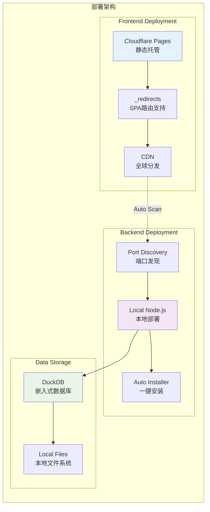
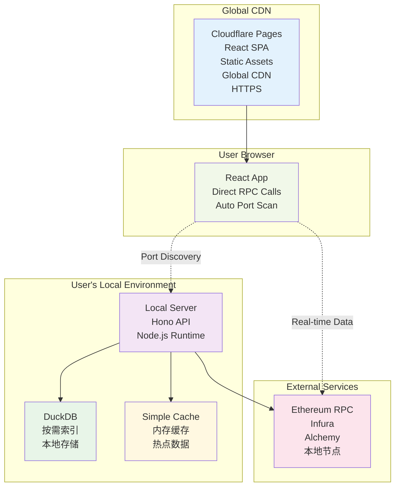

# 部署策略文档

## 部署架构图



## Cloudflare 部署选项

### 1. Cloudflare Pages（推荐）

**适用场景**：静态 SPA 应用，支持 React Router history 模式

#### 优势
- ✅ **完全免费**：每月500次构建，无限带宽
- ✅ **全球CDN**：自动全球分发
- ✅ **HTTPS**：自动SSL证书
- ✅ **Git集成**：推送即部署
- ✅ **SPA支持**：原生支持history路由
- ✅ **Functions**：支持轻量级边缘计算

#### SPA History 模式配置

**方法1：使用 _redirects 文件**
```bash
# public/_redirects
/* /index.html 200
```

**方法2：使用 Functions**
```typescript
// functions/_middleware.ts
export const onRequest: PagesFunction = async (context) => {
  const url = new URL(context.request.url);
  
  // API 代理（可选）
  if (url.pathname.startsWith('/api/')) {
    const apiUrl = new URL(url.pathname + url.search, 'http://your-local-server.com:3001');
    return fetch(apiUrl, context.request);
  }
  
  // 静态资源直接返回
  if (url.pathname.includes('.') || url.pathname.startsWith('/assets/')) {
    return await context.next();
  }
  
  // SPA 路由处理
  return await context.env.ASSETS.fetch(
    new Request(new URL('/index.html', url.origin))
  );
};
```

#### Vite 配置优化
```typescript
// vite.client.config.ts
export default defineConfig({
  build: {
    outDir: '../../dist/client',
    rollupOptions: {
      output: {
        manualChunks: {
          vendor: ['react', 'react-dom'],
          router: ['react-router-dom'],
          charts: ['echarts', 'echarts-for-react'],
        },
      },
    },
  },
  // Cloudflare Pages 优化
  base: '/',
  publicDir: path.resolve(__dirname, 'public'),
});
```

#### 部署配置
```yaml
# wrangler.toml（可选，主要用于 Functions 配置）
name = "block-explorer"
compatibility_date = "2024-01-01"

[build]
command = "npm run build:client"
destination = "dist/client"

[[env.production.vars]]
VITE_API_URL = "https://your-api-domain.com"

[[env.preview.vars]]
VITE_API_URL = "https://api-preview.your-domain.com"
```

### 2. Cloudflare Workers（可选）

**适用场景**：需要边缘计算或API代理的高级功能

#### 优势
- ✅ **边缘计算**：全球170+数据中心
- ✅ **API代理**：可以代理本地API请求
- ✅ **零冷启动**：V8隔离，毫秒级启动
- ✅ **动态内容**：支持服务端渲染
- ✅ **KV存储**：全球分布式存储

#### Worker 配置示例
```typescript
// worker.ts
export default {
  async fetch(request: Request, env: Env): Promise<Response> {
    const url = new URL(request.url);
    
    // API 代理到本地服务器
    if (url.pathname.startsWith('/api/')) {
      const apiUrl = new URL(url.pathname + url.search, env.API_BASE_URL);
      const apiRequest = new Request(apiUrl, {
        method: request.method,
        headers: request.headers,
        body: request.body,
      });
      
      return fetch(apiRequest);
    }
    
    // 静态资源和 SPA 路由
    try {
      return await env.ASSETS.fetch(request);
    } catch {
      // 404 时返回 index.html（SPA 路由）
      return await env.ASSETS.fetch(new Request(new URL('/index.html', url.origin)));
    }
  },
};
```

### 3. 推荐方案：Cloudflare Pages

对于我们的区块链浏览器项目，**推荐使用 Cloudflare Pages**：

#### 为什么选择 Pages 而不是 Workers？

1. **足够的功能**：
   - SPA history 模式完美支持
   - 静态资源优化和缓存
   - 全球 CDN 分发

2. **更简单的部署**：
   - Git 推送自动部署
   - 无需复杂的 Worker 配置
   - 自动 HTTPS 和域名管理

3. **成本优势**：
   - 完全免费使用
   - 无请求次数限制
   - 无需付费套餐

4. **开发体验**：
   - 分支预览功能
   - 构建日志清晰
   - 回滚功能

#### 部署流程

```bash
# 1. 构建前端
npm run build:client

# 2. 配置 _redirects
echo "/* /index.html 200" > dist/client/_redirects

# 3. 推送到 Git（自动触发 Cloudflare Pages 部署）
git add .
git commit -m "Deploy to Cloudflare Pages"
git push origin main
```

## 完整的部署架构

### 完整部署架构图



### 网络流量

1. **静态资源**：Cloudflare Pages CDN
2. **实时数据**：浏览器 → RPC 节点
3. **历史数据**：浏览器 → 本地服务器
4. **搜索功能**：浏览器 → 本地服务器

## 高级配置

### 1. 环境变量配置
```bash
# Cloudflare Pages 环境变量
VITE_API_URL=http://localhost:3001  # 开发环境
VITE_API_URL=https://your-api.com   # 生产环境
VITE_ETHEREUM_RPC_URL=https://mainnet.infura.io/v3/YOUR_KEY
VITE_APP_VERSION=1.0.0
```

### 2. 缓存策略
```typescript
// public/_headers
/*
  Cache-Control: public, max-age=31536000, immutable

/index.html
  Cache-Control: public, max-age=0, must-revalidate

/assets/*
  Cache-Control: public, max-age=31536000, immutable

/api/*
  Cache-Control: no-cache
```

### 3. 性能优化
```typescript
// vite.client.config.ts 添加
export default defineConfig({
  build: {
    rollupOptions: {
      output: {
        manualChunks: {
          vendor: ['react', 'react-dom'],
          router: ['react-router-dom'],
          charts: ['echarts'],
          crypto: ['viem'],
        },
      },
    },
    // 启用代码分割
    chunkSizeWarningLimit: 1600,
  },
  // 预加载关键资源
  optimizeDeps: {
    include: ['react', 'react-dom', 'react-router-dom'],
  },
});
```

### 4. 安全配置
```typescript
// functions/_middleware.ts 添加安全头
export const onRequest: PagesFunction = async (context) => {
  const response = await context.next();
  
  // 安全头
  response.headers.set('X-Content-Type-Options', 'nosniff');
  response.headers.set('X-Frame-Options', 'DENY');
  response.headers.set('X-XSS-Protection', '1; mode=block');
  response.headers.set('Referrer-Policy', 'strict-origin-when-cross-origin');
  
  return response;
};
```

## 多环境部署

### 开发环境
- **前端**：`npm run dev:client` (localhost:3000)
- **后端**：`npm run dev:server` (localhost:3001)
- **数据源**：直接 RPC + 按需索引

### 预览环境
- **前端**：Cloudflare Pages 预览分支
- **后端**：测试服务器
- **数据源**：测试网或主网

### 生产环境
- **前端**：Cloudflare Pages 主分支
- **后端**：生产服务器
- **数据源**：主网 + 生产数据库

## 监控和分析

### Cloudflare Analytics
- 页面访问量
- 地理分布
- 性能指标
- 错误率

### 自定义监控
```typescript
// 前端性能监控
const trackPageView = (path: string) => {
  if (typeof gtag !== 'undefined') {
    gtag('config', 'GA_MEASUREMENT_ID', {
      page_path: path,
    });
  }
};

// RPC 调用监控
const trackRPCCall = (method: string, duration: number) => {
  console.log(`RPC ${method}: ${duration}ms`);
  // 可以发送到分析服务
};
```

## 总结

**推荐使用 Cloudflare Pages**，原因：

1. ✅ **原生支持 SPA history 模式**
2. ✅ **完全免费，性能优秀**
3. ✅ **部署简单，维护成本低**
4. ✅ **全球 CDN，访问速度快**
5. ✅ **HTTPS 自动配置**

Worker 适合更复杂的场景，但对我们的项目来说，Pages 已经完全够用了！
